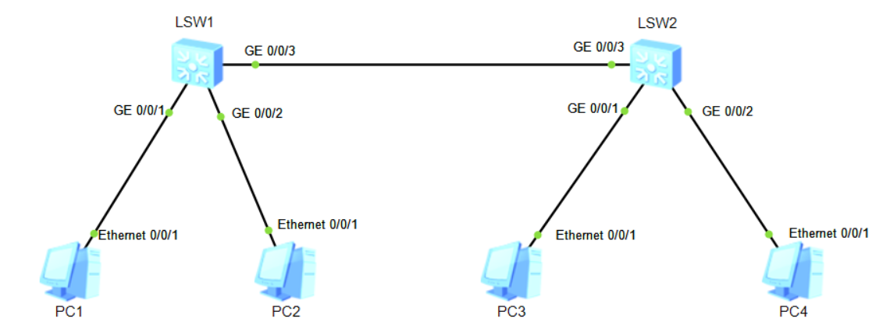
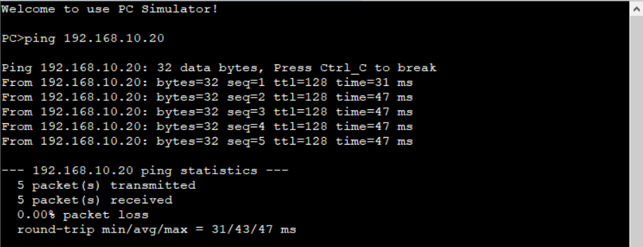
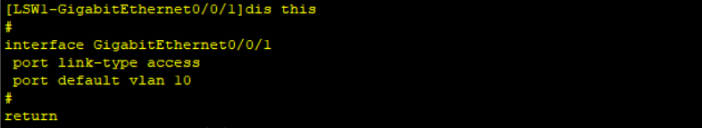
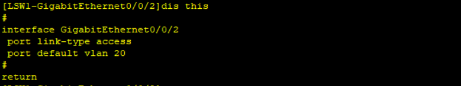
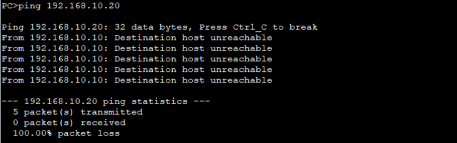
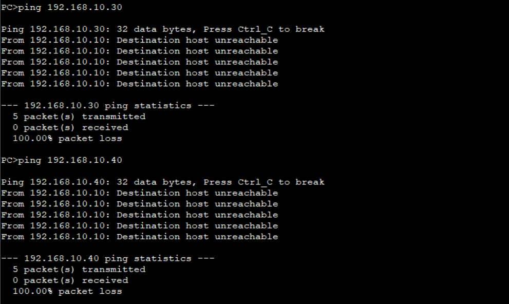
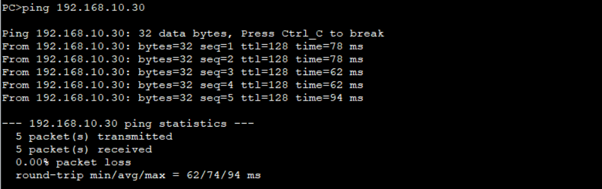
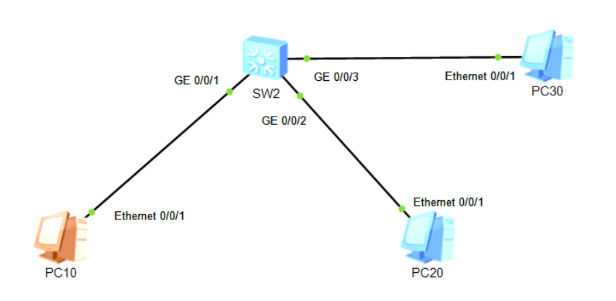

# 二、VLAN配置

## 重要配置命令

```bash
[Huawei] vlan batch 10 to 30 # 创建 vlan10 至 vlan30
[Huawei] vlan batch 10 20 30 # 创建 vlan10、vlan20、vlan30
[Huawei] vlan 10 # 创建 vlan10
[Huawei] interface Ethernet0/0/1 # 进入 e0/0/1 接口
[Huawei-Ethernet0/0/1] port link-type access # 配置 g0/0/1 为 access 模式
[Huawei-Ethernet0/0/1] port default vlan 10 # 配置 g0/0/1 属于 vlan10
[Huawei-Ethernet0/0/1] port link-type trunk # 配置 g0/0/1 为 trunk 模式
[Huawei-Ethernet0/0/1] port trunk allow-pass vlan 10 # 配置 trunk 链路放行 vlan10
[Huawei-Ethernet0/0/1] port trunk allow-pass vlan all # 配置 trunk 链路放行所有 vlan
[Huawei-Ethernet0/0/1] port link-type hybrid # 配置 g0/0/1 为 hybrid 模式
[Huawei-Ethernet0/0/1] port hybrid pvid vlan 10 # 配置 g0/0/1 属于为数据帧打上 pvid 10 标签
[Huawei-Ethernet0/0/1] port hybrid tagged vlan 10 # 配置 g0/0/1 可以携带 vlan10 的数据帧
[Huawei-Ethernet0/0/1] port hybrid untagged vlan 10 # 配置 g0/0/1 可以剥离 vlan10 的数据帧
```

## 拓扑



## 准备工作

| 设备名称 |    IP地址     | 网关 |
| :------: | :-----------: | :--: |
|   PC1    | 192.168.10.10 |  -   |
|   PC2    | 192.168.10.20 |  -   |
|   PC3    | 192.168.10.30 |  -   |
|   PC4    | 192.168.10.40 |  -   |

## 实验步骤

### 1. Access链路

0. 从`PC1`到`PC2`，是能够ping通的



1. 在`LSW1`上，配置`g0/0/1`为`vlan10`，`g0/0/2`为`vlan20`

```bash
# 初始化配置
<Huawei> system-view
[Huawei] un in en
[Huawei] sysname LSW1
# 创建vlan 10，vlan 20
[LSW1] vlan batch 10 20
# 配置g0/0/1
[LSW1] int g0/0/1
[LSW1-GigabitEthernet0/0/1] port link-type access
[LSW1-GigabitEthernet0/0/1] port default vlan 10
[LSW1-GigabitEthernet0/0/1] quit
#配置g0/0/2 
[LSW1] int g0/0/2
[LSW1-GigabitEthernet0/0/2] port link-type access
[LSW1-GigabitEthernet0/0/2] port default vlan 20
[LSW1-GigabitEthernet0/0/2] quit
```





2. 同理，在`LSW2`上，配置`g0/0/1`为`vlan10`，`g0/0/2`为`vlan20`

```bash
# 创建vlan 10，vlan 20
[LSW2] vlan batch 10 20
# 配置g0/0/1
[LSW2] int g0/0/1
[LSW2-GigabitEthernet0/0/1] port link-type access
[LSW2-GigabitEthernet0/0/1] port default vlan 10
[LSW2-GigabitEthernet0/0/1] quit
#配置g0/0/2 
[LSW2] int g0/0/2
[LSW2-GigabitEthernet0/0/2] port link-type access
[LSW2-GigabitEthernet0/0/2] port default vlan 20
[LSW2-GigabitEthernet0/0/2] quit
```

3. 此时查看`PC1`和`PC2`不再能够ping通



同理，`PC3`和`PC4`也是不能够ping通的

4. 此时，同一个VLAN的`PC1`去ping`PC3`，也是不能通的



::: info

1. 交换机里面默认是有一个vlan1的，所以如果g0/0/1配置了vlan10的话，就相当于已经把端口隔离了，所以PC1到PC3就不能通信了。
2. LSW1和LSW2之间没有配置Trunk，所以

:::

### 2. Trunk 链路

要想同一个VLAN之间能通的话，需要在`LSW1`和`LSW2`之间创建一个Trunk链路。

```bash
# 在 LSW1 的 g/0/0/3 上配置trunk
[LSW1] int g0/0/3
[LSW1-GigabitEthernet0/0/3] port link-type trunk
[LSW1-GigabitEthernet0/0/3] port trunk allow-pass vlan 10 20
# 在 LSW2 的 g/0/0/3 上配置trunk
[LSW2] int g0/0/3
[LSW2-GigabitEthernet0/0/3] port link-type trunk
[LSW2-GigabitEthernet0/0/3] port trunk allow-pass vlan 10 20
```

此时`PC1`再去ping`PC3`，就能通了



### 3. Hybird 链路

配置前，需要更改一下拓扑图



| 设备名称 |    IP地址     | 网关 | VLAN |
| :------: | :-----------: | :--: | :--: |
|   PC10   | 192.168.10.10 |  -   |  10  |
|   PC20   | 192.168.10.20 |  -   |  20  |
|   PC30   | 192.168.10.30 |  -   |  30  |

需要实现PC10与PC20不互通，PC10与PC30、PC20与PC30互通

```bash
# 配置g0/0/1
[SW2] int g0/0/1
[SW2-GigabitEthernet0/0/1] port link-type hybrid
[SW2-GigabitEthernet0/0/1] port hybrid pvid vlan 10
[SW2-GigabitEthernet0/0/1] port hybrid untagged vlan 10 30
# 配置g0/0/2
[SW2-GigabitEthernet0/0/3] int g0/0/2
[SW2-GigabitEthernet0/0/2] port link-type hybrid
[SW2-GigabitEthernet0/0/2] port hybrid pvid vlan 20
[SW2-GigabitEthernet0/0/2] port hybrid untagged vlan 20 30
# 配置g0/0/3
[SW2-GigabitEthernet0/0/1] int g0/0/3
[SW2-GigabitEthernet0/0/3] port link-type hybrid
[SW2-GigabitEthernet0/0/3] port hybrid pvid vlan 30
[SW2-GigabitEthernet0/0/3] port hybrid untagged vlan 10 20 30
```

