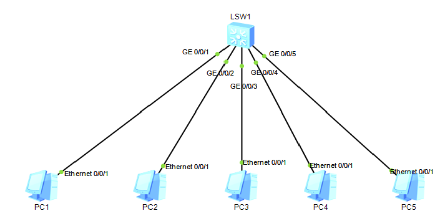

# 二十、二层隔离配置

## 重要配置命令

```bash
[Huawei-vlan10] mux-vlan # 配置 vlan 10 为 mux-vlan
[Huawei-vlan10] subordinate group 20 # 配置 vlan 20 为互通型从 vlan
[Huawei-vlan10] subordinate separate 30 # 配置 vlan 30 为隔离型从 vlan
[Huawei-GigabitEthernet0/0/1] port mux-vlan enable # 端口开启 mux-vlan 功能

# 所有 PC 需要配置相同网段的 IP 地址。
```

## 拓扑



## 准备工作

| 设备名称 | 接口   | IP地址        |
| -------- | ------ | ------------- |
| PC1      | E0/0/1 | 192.168.10.10 |
| PC2      | E0/0/1 | 192.168.10.20 |
| PC3      | E0/0/1 | 192.168.10.30 |
| PC4      | E0/0/1 | 192.168.10.40 |
| PC5      | E0/0/1 | 192.168.10.50 |

## 步骤

1. 开启`mux-vlan`

```bash
[LSW1] vlan batch 10 20 30
[LSW1] mux-vlan
[LSW1] vlan 10
[LSW1-vlan10] subordinate group 20
[LSW1-vlan10] subordinate separate 30
```

2. 给各个端口配置VLAN

```bash
[LSW1] interface GigabitEthernet 0/0/1
[LSW1-GigabitEthernet0/0/1] port link-type access
[LSW1-GigabitEthernet0/0/1] port default vlan 10

[LSW1-GigabitEthernet0/0/1] interface GigabitEthernet 0/0/2
[LSW1-GigabitEthernet0/0/2] port link-type access
[LSW1-GigabitEthernet0/0/2] port default vlan 10

[LSW1-GigabitEthernet0/0/2] interface GigabitEthernet 0/0/3
[LSW1-GigabitEthernet0/0/3] port link-type access
[LSW1-GigabitEthernet0/0/3] port default vlan 10

[LSW1-GigabitEthernet0/0/3] interface GigabitEthernet 0/0/4
[LSW1-GigabitEthernet0/0/4] port link-type access
[LSW1-GigabitEthernet0/0/4] port default vlan 10

[LSW1-GigabitEthernet0/0/4] interface GigabitEthernet 0/0/5
[LSW1-GigabitEthernet0/0/5] port link-type access
[LSW1-GigabitEthernet0/0/5] port default vlan 10
```

3. 给各个端口开启`mux-vlan`

```bash
[LSW1] interface GigabitEthernet 0/0/1
[LSW1-GigabitEthernet0/0/1] port mux-vlan enable

[LSW1-GigabitEthernet0/0/1] interface GigabitEthernet 0/0/2
[LSW1-GigabitEthernet0/0/2] port mux-vlan enable

[LSW1-GigabitEthernet0/0/2] interface GigabitEthernet 0/0/3
[LSW1-GigabitEthernet0/0/3] port mux-vlan enable

[LSW1-GigabitEthernet0/0/3] interface GigabitEthernet 0/0/4
[LSW1-GigabitEthernet0/0/4] port mux-vlan enable

[LSW1-GigabitEthernet0/0/4] interface GigabitEthernet 0/0/5
[LSW1-GigabitEthernet0/0/5] port mux-vlan enable
```

此时，可以测试各个PC之间能否互通。

+ VLAN 10 是 主 VLAN，所以 PC1 是能够ping所有PC的
+ VLAN 20  是 互通性从 VLAN，所以 PC2 和 PC3 是互通的，但是PC2去pingPC4、PC5是不通的；同理，PC3也类似
+ VLAN 30 是 隔离性从 VLAN，所以PC4和PC5与任意一台PC都不互通