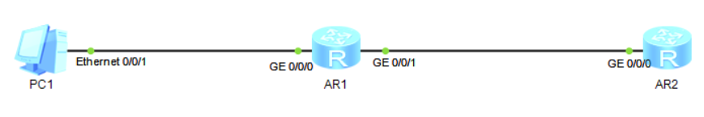

# 二十一、PPPoE配置

## 重要配置命令

```bash
[Huawei] dialer-rule # 创建 dialer 列表
[Huawei-dialer-rule] dialer-rule 1 ip permit # dialer 列表 1 规则为放行 IP 数据包
[Huawei] interface dialer 1 # 进入 dialer 接口 1
[Huawei-Dialer1] dialer user admin # dialer 用户名 admin
[Huawei-Dialer1] dialer-group 1 # 创建 dialer 组 1
[Huawei-Dialer1] dialer bundle 1 # 绑定 dialer 组 1 与列表 1
[Huawei-Dialer1] dialer timer idle 300 # 设置的断开链路的超时时间
[Huawei-Dialer1] ppp chap user admin # 配置 PPP 为 chap 认证，用户名为 admin
[Huawei-Dialer1] ppp chap password cipher huawei123 # 配置 PPP 的 chap 密码为 huawei123
[Huawei-Dialer1] ip address ppp-negotiate # 配置 IP 地址为自动协商模式
[Huawei-GigabitEthernet0/0/1] pppoe-client dial-bundle-number 1 on-demand # 接口建立 pppoe 为按需拨号方式
[Huawei] acl 2000 # 创建 acl 2000
[Huawei-acl-basic-2000] rule 5 permit source 192.168.1.0 0.0.0.255 # 匹配源地址为 192.168.1.0/24 网段的 IP
[Huawei] interface dialer 1 # 进入 dialer 接口 1
[Huawei-Dialer1] nat outbound 2000 # 将 ACL 2000 匹配的网段 IP 进行 NAT 转换
```

## 拓扑



## 步骤

1. 因为模拟器上看不了什么现象，也就相当于把上面的重要配置命令敲一遍即可。