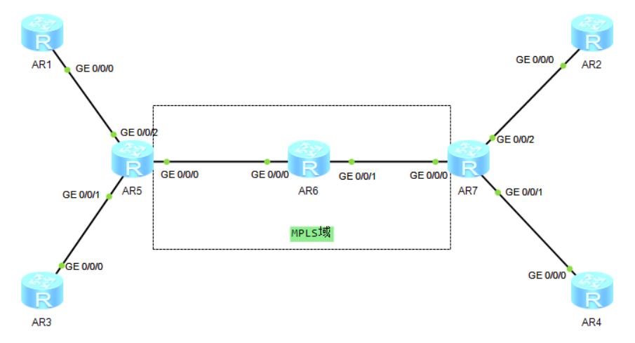

# 二十三、MPLS-VPN配置

## 重要配置命令

```bash
[Huawei] mpls lsr-id 5.5.5.5 # 配置 R2 的 lsr-id 为 5.5.5.5
[Huawei] mpls # 启用 mpls 功能
[Huawei] mpls ldp # 启用 mpls ldp 功能
[Huawei-Ethernet0/0/0] mpls # 接口下启用 mpls 功能
[Huawei-Ethernet0/0/0] mpls ldp # 接口下启用 mpls ldp 功能
[Huawei] ip vpn-instance vpna # 配置 vpn 实例 vpna
[Huawei-vpn-instance-vpna] ipv4-family # 进入 ipv4 地址簇
[Huawei-vpn-instance-vpna-af-ipv4] route-distinguisher 100:100 # 配置 RD 为 100:100
[Huawei-vpn-instance-vpna-af-ipv4] vpn-target 100:200 export-extcommunity # 配置 vpn 的 rt 导出值为 100:200
[Huawei-vpn-instance-vpna-af-ipv4] vpn-target 200:100 import-extcommunity # 配置 vpn 的 rt 导入值为 200:100
[Huawei-Ethernet0/0/0] ip binding vpn-instance vpna # 接口绑定实例 vpna
[Huawei] bgp 100 # 配置 BGP 的 AS 域 100
[Huawei-bgp] peer 7.7.7.7 as-number 100 # 配置 ibgp 对等体为 7.7.7.7，AS 号为 100
[Huawei-bgp] peer 7.7.7.7 connect-interface loopback 0 # 对 7.7.7.7 配置更新源接口为环回接口 LoopBack 0
[Huawei-bgp] ipv4-family vpnv4 # 进入 vpnv4 地址簇
[Huawei-bgp-af-vpnv4] peer 7.7.7.7 enable # 激活对等体 7.7.7.7
[Huawei-bgp] ipv4-family vpn-instance vpna # 进入 vpn 实例 vpna
[Huawei-bgp-vpna] import-route ospf 
```

## 拓扑



## 准备工作

| 设备名称 | 接口       | IP地址      |
| -------- | ---------- | ----------- |
| AR1      | LoopBack 0 | 10.1.1.1/24 |
|          | GE0/0/0    | 15.0.0.1/24 |
| AR2      | LoopBack 0 | 10.1.2.1/24 |
|          | GE0/0/0    | 27.0.0.2/24 |
| AR3      | LoopBack 0 | 10.1.1.1/24 |
|          | GE0/0/0    | 35.0.0.3/24 |
| AR4      | LoopBack 0 | 10.1.2.1/24 |
|          | GE0/0/0    | 47.0.0.4/24 |
| AR5      | LoopBack 0 | 5.5.5.5/32  |
|          | GE0/0/0    | 56.0.0.5/24 |
|          | GE0/0/1    | 35.0.0.5/24 |
|          | GE0/0/2    | 15.0.0.5/24 |
| AR6      | LoopBack 0 | 6.6.6.6/32  |
|          | GE0/0/0    | 56.0.0.6/24 |
|          | GE0/0/1    | 67.0.0.6/24 |
| AR7      | LoopBack 0 | 7.7.7.7/32  |
|          | GE0/0/0    | 47.0.0.7/24 |
|          | GE0/0/1    | 27.0.0.7/24 |

## 步骤

1. 先配置底层路由

```bash
[AR5] ospf
[AR5-ospf-1] area 0
[AR5-ospf-1-area-0] interface GigabitEthernet 0/0/0
[AR5-GigabitEthernet0/0/0] ospf enable area 0
[AR5-GigabitEthernet0/0/0] interface LoopBack 0
[AR5-LoopBack0] ospf enable area 0

[AR6] ospf
[AR6-ospf-1] area 0
[AR6-ospf-1-area-0] interface GigabitEthernet 0/0/0
[AR6-GigabitEthernet0/0/0] ospf enable area 0
[AR6-GigabitEthernet0/0/0] interface GigabitEthernet 0/0/1
[AR6-GigabitEthernet0/0/1] ospf enable area 0
[AR6-GigabitEthernet0/0/1] interface LoopBack 0
[AR6-LoopBack0] ospf enable area 0

[AR7] ospf
[AR7-ospf-1] area 0
[AR7-ospf-1-area-0] interface GigabitEthernet 0/0/0
[AR7-GigabitEthernet0/0/0] ospf enable area 0
[AR7-GigabitEthernet0/0/0] interface LoopBack 0
[AR7-LoopBack0] ospf enable area 0
```

配置完成后，使用`display ospf peer brief`检查配置是否成功


2. AR5和AR7建立IBGP邻居

```bash
[AR5] bgp 100
[AR5-bgp] router-id 5.5.5.5
[AR5-bgp] peer 7.7.7.7 as-number 100
[AR5-bgp] peer 7.7.7.7 next-hop-local
[AR5-bgp] peer 7.7.7.7 connect-interface LoopBack 0
[AR5-bgp] ipv4-family vpnv4 unicast
[AR5-bgp-af-vpnv4] peer 7.7.7.7 enable

[AR7] bgp 100
[AR7-bgp] router-id 7.7.7.7
[AR7-bgp] peer 5.5.5.5 as-number 100
[AR7-bgp] peer 5.5.5.5 next-hop-local
[AR7-bgp] peer 5.5.5.5 connect-interface LoopBack 0
[AR7-bgp] ipv4-family vpnv4 unicast
[AR7-bgp-af-vpnv4] peer 5.5.5.5 enable
```

配置完成后，使用`display bgp vpnv4 all peer`检查配置是否成功


3. 配置AR5、AR6、AR7三个设备的MPLS

```bash
[AR5] mpls lsr-id 5.5.5.5
[AR5] mpls
[AR5-mpls] mpls ldp
[AR5-mpls-ldp] interface GigabitEthernet 0/0/0
[AR5-GigabitEthernet0/0/0] mpls
[AR5-GigabitEthernet0/0/0] mpls ldp

[AR6] mpls lsr-id 6.6.6.6
[AR6] mpls
[AR6-mpls] mpls ldp
[AR6-mpls-ldp] interface GigabitEthernet 0/0/0
[AR6-GigabitEthernet0/0/0] mpls
[AR6-GigabitEthernet0/0/0] mpls ldp
[AR6-GigabitEthernet0/0/0] interface GigabitEthernet 0/0/1
[AR6-GigabitEthernet0/0/1] mpls
[AR6-GigabitEthernet0/0/1] mpls ldp

[AR7] mpls lsr-id 7.7.7.7
[AR7] mpls
[AR7-mpls] mpls ldp
[AR7-mpls-ldp] interface GigabitEthernet 0/0/0
[AR7-GigabitEthernet0/0/0] mpls
[AR7-GigabitEthernet0/0/0] mpls ldp
```

配置完成后，使用`display bgp vpnv4 all peer`检查配置是否成功


4. 实例配置

```bash
[AR5] ip vpn-instance 1
[AR5-vpn-instance-1] route-distinguisher 100:100
[AR5-vpn-instance-1-af-ipv4] vpn-target 100:200 export-extcommunity
[AR5-vpn-instance-1-af-ipv4] vpn-target 200:100 import-extcommunity
[AR5] ip vpn-instace 2
[AR5-vpn-instance-1] route-distinguisher 200:200
[AR5-vpn-instance-1-af-ipv4] vpn-target 300:400 export-extcommunity
[AR5-vpn-instance-1-af-ipv4] vpn-target 400:300 import-extcommunity
[AR5] interface GigabitEthernet0/0/2
[AR5-GigabitEthernet0/0/2] ip binding vpn-instance 1
[AR5-GigabitEthernet0/0/2] ip address 15.0.0.5 24
[AR5-GigabitEthernet0/0/2] interface GigabitEthernet0/0/1
[AR5-GigabitEthernet0/0/1] ip address 35.0.0.5 24

[AR7] ip vpn-instance 1
[AR7-vpn-instance-1] route-distinguisher 100:100
[AR7-vpn-instance-1-af-ipv4] vpn-target 200:100 export-extcommunity
[AR7-vpn-instance-1-af-ipv4] vpn-target 100:200 import-extcommunity
[AR7] ip vpn-instace 2
[AR7-vpn-instance-1] route-distinguisher 200:200
[AR7-vpn-instance-1-af-ipv4] vpn-target 400:300 export-extcommunity
[AR7-vpn-instance-1-af-ipv4] vpn-target 300:400 import-extcommunity
[AR7] interface GigabitEthernet0/0/2
[AR7-GigabitEthernet0/0/2] ip binding vpn-instance 1
[AR7-GigabitEthernet0/0/2] ip address 27.0.0.7 24
[AR7-GigabitEthernet0/0/2] interface GigabitEthernet0/0/1
[AR7-GigabitEthernet0/0/1] ip address 47.0.0.7 24
```

5. AR1和AR5、AR7和AR2配置RIP协议，AR3和AR5、AR7和AR4配置OSPF协议。

```bash 
# 配置RIP
[AR1] rip
[AR1-rip-1] version 2
[AR1-rip-1] network 10.0.0.0
[AR1-rip-1] network 15.0.0.0

[AR2] rip
[AR2-rip-1] version 2
[AR2-rip-1] network 10.0.0.0
[AR2-rip-1] network 27.0.0.0

[AR5] rip vpn-instance 1
[AR5-rip-1] version 2
[AR5-rip-1] network 27.0.0.0

[AR7] rip vpn-instance 1
[AR7-rip-1] version 2
[AR7-rip-1] network 27.0.0.0

# 配置OSPF
[AR3] ospf 100
[AR3-ospf-100] area 0
[AR3-ospf-100-area-0.0.0.0]network 10.1.1.0 0.0.0.255
[AR3-ospf-100-area-0.0.0.0]network 35.0.0.0 0.0.0.255

[AR4] ospf 100
[AR4-ospf-100] area 0
[AR4-ospf-100-area-0.0.0.0]network 10.1.1.0 0.0.0.255
[AR4-ospf-100-area-0.0.0.0]network 47.0.0.0 0.0.0.255

[AR5]ospf 100 vpn-instance 2
[AR5-ospf-100]area 0
[AR5-ospf-100-area-0.0.0.0]net 35.0.0.0 0.0.0.255

[AR7]ospf 100 vpn-instance 2
[AR7-ospf-100]area 0
[AR7-ospf-100-area-0.0.0.0]net 47.0.0.0 0.0.0.255
```

6. 把RIP、OSPF引入到BGP里面

```bash
[AR5] bgp 100
[AR5-bgp] ipv4-family vpn-instance 1
[AR5-bgp-1] import-route rip 1
[AR5-bgp-1] ipv4-family vpn-instance 2
[AR5-bgp-2] import-route ospf 100
[AR5] rip vpn-instance 1
[AR5-rip-1] import-route bgp
[AR5] ospf 100 vpn-instance 2
[AR5-ospf-100] import-route bgp

[AR7] bgp 100
[AR7-bgp] ipv4-family vpn-instance 1
[AR7-bgp-1] import-route rip 1
[AR7-bgp-1] ipv4-family vpn-instance 2
[AR7-bgp-2] import-route ospf 100
[AR7] rip vpn-instance 1
[AR7-rip-1] import-route bgp
[AR7] ospf 100 vpn-instance 2
[AR7-ospf-100] import-route bgp
```

配置完成后，检查配置是否成功

```bash
[Huawei] display ip routing-table vpn-instance 1
[Huawei] display ip routing-table vpn-instance 2
```


同时查看AR1、AR2、AR3、AR4的路由表，查看是否有学习到路由。


7. 用AR1、AR3去ping`10.1.2.1`，分别在AR2、AR4抓包，观察ICMP报文是否有去到相对应的路径。

