# 二十二、MPLS静态与动态配置

## 重要配置命令

```bash
[Huawei] mpls lsr-id 1.1.1.1 # mpls 的 lsr-id 为 1.1.1.1
[Huawei] mpls # 使能 mpls
[Huawei] static-lsp ingress 1to4 destination 10.4.4.4 32 nexthop 12.0.0.2 out-label 1002 # ingress 边界配置目的 4.4.4.4/32 的下一跳为 12.0.0.2，出标签为 1002
[Huawei] static-lsp egress 4to1 incoming-interface Ethernet0/0/0 in-label 1011 # egress 边界的入方向接口为 e0/0/0，入标签为 1011
[Huawei] static-lsp transit 1to4 incoming-interface Ethernet0/0/0 in-label 1002 nexthop 23.0.0.3 out-label 1003 # transit 节点的入方向接口为 e0/0/0，入标签为 1002，下一跳为 23.0.0.3，出标签为 1003
[Huawei] mpls # 使能 mpls
[Huawei] mpls ldp # 使能 mpls ldp
[Huawei-Ethernet0/0/0] mpls # 接口下使能 mpls
[Huawei-Ethernet0/0/0] mpls ldp # 接口下使能 mpls ld
```

## 拓扑

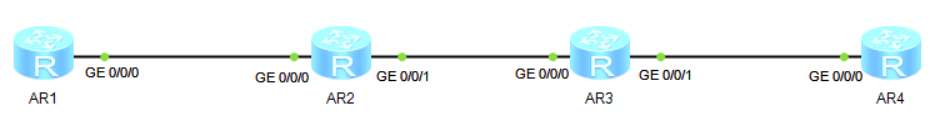

## 准备工作

| 设备名称 | 接口       | IP地址      |
| -------- | ---------- | ----------- |
| AR1      | LoopBack 0 | 1.1.1.1/32  |
|          | LoopBack 1 | 10.1.1.1/32 |
|          | GE0/0/0    | 12.0.0.1/24 |
| AR2      | LoopBack 0 | 2.2.2.2/32  |
|          | GE0/0/0    | 12.0.0.2/24 |
|          | GE0/0/1    | 23.0.0.2/24 |
| AR3      | LoopBack 0 | 3.3.3.3/32  |
|          | GE0/0/0    | 23.0.0.3/24 |
|          | GE0/0/1    | 34.0.0.3/24 |
| AR4      | LoopBack 0 | 4.4.4.4/32  |
|          | LoopBack 1 | 10.4.4.4/32 |
|          | GE0/0/0    | 34.0.0.4/24 |

## 步骤

### MPLS静态配置

1. 先从AR1配置到AR4

```bash
# 开启mpls
[AR1] mpls lsr-id 1.1.1.1
[AR1] mpls
[AR1-mpls] interface GigabitEthernet 0/0/0
[AR1-GigabitEthernet0/0/0] mpls
[AR1-GigabitEthernet0/0/0] interface GigabitEthernet 0/0/1
[AR1-GigabitEthernet0/0/1] mpls
[AR1] static-lsp ingress 1to4 destination 10.4.4.4 32 nexthop 12.0.0.2 out-label

[AR2] mpls lsr-id 2.2.2.2
[AR2] mpls
[AR2-mpls] interface GigabitEthernet 0/0/0
[AR2-GigabitEthernet0/0/0] mpls
[AR2-GigabitEthernet0/0/0] interface GigabitEthernet 0/0/1
[AR2-GigabitEthernet0/0/1] mpls
[AR2] static-lsp transit 1to4 incoming-interface GigabitEthernet 0/0/0 in-label 1002 nexthop 23.0.0.3 out-label 1003

[AR3] mpls lsr-id 3.3.3.3
[AR3] mpls
[AR3-mpls] interface GigabitEthernet 0/0/0
[AR3-GigabitEthernet0/0/0] mpls
[AR3-GigabitEthernet0/0/0] interface GigabitEthernet 0/0/1
[AR3-GigabitEthernet0/0/1] mpls
[AR3] static-lsp transit 1to4 incoming-interface GigabitEthernet 0/0/0 in-label 1003 nexthop 34.0.0.4 out-label 1004

[AR4] mpls lsr-id 4.4.4.4
[AR4] mpls
[AR4-mpls] interface GigabitEthernet 0/0/0
[AR4-GigabitEthernet0/0/0] mpls
[AR4-GigabitEthernet0/0/0] interface GigabitEthernet 0/0/1
[AR4-GigabitEthernet0/0/1] mpls
[AR4] static-lsp egress 1to4 incoming-interface GigabitEthernet 0/0/0 in-label 1004
```

2. 再从AR4配置回到AR1

```bash
[AR4] static-lsp ingress 4to1 destination 10.1.1.1 32 nexthop 34.0.0.3 out-label

[AR3] static-lsp transit 4to1 incoming-interface GigabitEthernet 0/0/1 in-label 1013 nexthop 23.0.0.2 out-label 1012

[AR2] static-lsp transit 4to1 incoming-interface GigabitEthernet 0/0/1 in-label 1012 nexthop 12.0.0.1 out-label 1011

[AR1] static-lsp egress 4to1 incoming-interface GigabitEthernet 0/0/0 in-label 1011
```

3. 此时还需要在AR1和AR4上配置静态路由，不然查看mpls表的时候会少了一条出去的标签

```bash
[AR1] ip route-static 10.4.4.4 32 12.0.0.2

[AR4] ip route-static 10.1.1.1 32 34.0.0.3
```

4. 可以查看是否有配置成功

```bash
[Huawei] display mpls lsp
```

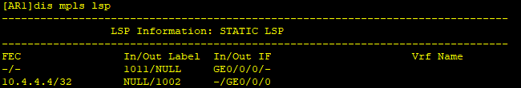

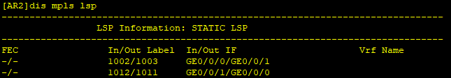

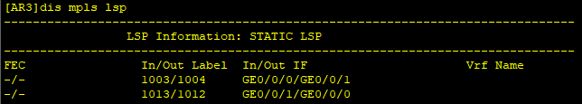

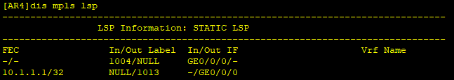

5. 在任意一个节点上抓包，同时使用命令pingAR4

```bash
[AR1] ping -a 10.1.1.1 10.4.4.4
```

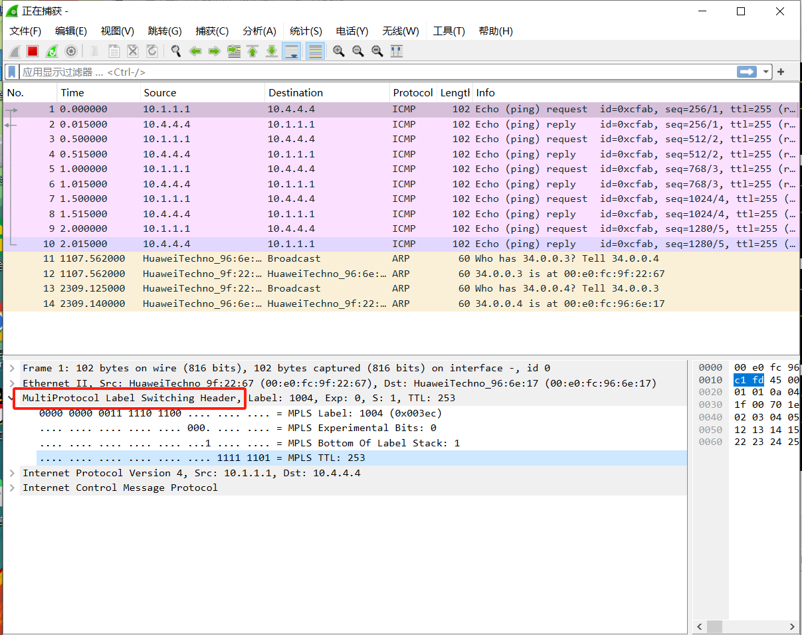

可以看到，MPLS确实在“2.5层”。

### 动态MPLS配置

1. 先把上面的静态配置与静态路由取消掉
2. 先用OSPF启用底层路由

```bash
[AR1] ospf
[AR1-ospf-1] area 0
[AR1-ospf-1-area-0.0.0.0] interface LoopBack 0
[AR1-LoopBack0] ospf enable area 0
[AR1-LoopBack0] interface LoopBack 1
[AR1-LoopBack1] ospf enable area 0
[AR1-LoopBack1] interface GigabitEthernet 0/0/0
[AR1-GigabitEthernet0/0/0] ospf enable area 0

[AR2] ospf
[AR2-ospf-1] area 0
[AR2-ospf-1-area-0.0.0.0] interface LoopBack 0
[AR2-LoopBack0] ospf enable area 0
[AR2-LoopBack0] interface GigabitEthernet 0/0/0
[AR2-GigabitEthernet0/0/0] ospf enable area 0
[AR2-GigabitEthernet0/0/0] interface GigabitEthernet 0/0/1
[AR2-GigabitEthernet0/0/1] ospf enable area 0

[AR3] ospf
[AR3-ospf-1] area 0
[AR3-ospf-1-area-0.0.0.0] interface LoopBack 0
[AR3-LoopBack0] ospf enable area 0
[AR3-LoopBack0] interface GigabitEthernet 0/0/0
[AR3-GigabitEthernet0/0/0] ospf enable area 0
[AR3-GigabitEthernet0/0/0] interface GigabitEthernet 0/0/1
[AR3-GigabitEthernet0/0/1] ospf enable area 0

[AR4] ospf
[AR4-ospf-1] area 0
[AR4-ospf-1-area-0.0.0.0] interface LoopBack 0
[AR4-LoopBack0] ospf enable area 0
[AR4-LoopBack0] interface LoopBack 1
[AR4-LoopBack1] ospf enable area 0
[AR4-LoopBack1] interface GigabitEthernet 0/0/0
[AR4-GigabitEthernet0/0/0] ospf enable area 0
```

3. 启用MPLS

```bash
[AR1] mpls
[AR1] mpls ldp
[AR1] interface GigabitEthernet 0/0/0
[AR1-GigabitEthernet0/0/0] mpls ldp

[AR2] mpls
[AR2] mpls ldp
[AR2] interface GigabitEthernet 0/0/0
[AR2-GigabitEthernet0/0/0] mpls ldp
[AR2-GigabitEthernet0/0/0] interface GigabitEthernet 0/0/1
[AR2-GigabitEthernet0/0/1] mpls ldp

[AR3] mpls
[AR3] mpls ldp
[AR3] interface GigabitEthernet 0/0/0
[AR3-GigabitEthernet0/0/0] mpls ldp
[AR3-GigabitEthernet0/0/0] interface GigabitEthernet 0/0/1
[AR3-GigabitEthernet0/0/1] mpls ldp

[AR4] mpls
[AR4] mpls ldp
[AR4] interface GigabitEthernet 0/0/0
[AR4-GigabitEthernet0/0/0] mpls ldp
```

4. 查看MPLS路径是否配置成功

```bash
[Huawei] display mpls ldp peer
```

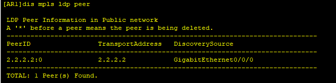

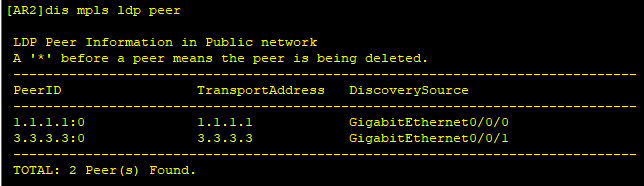

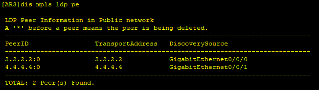

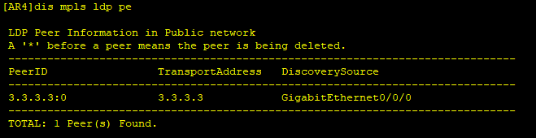

同时也可以查看lsp路径有没有生效

```bash
[Huawei] display mpls lsp 
```

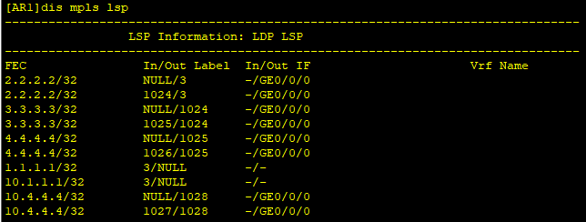

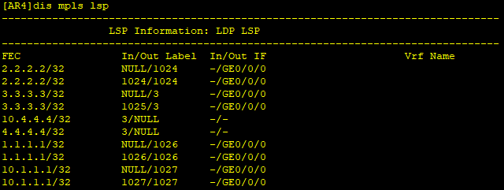

5. 在任意节点上开始抓包

```bash
[AR1] ping -a 10.1.1.1 10.4.4.4
```

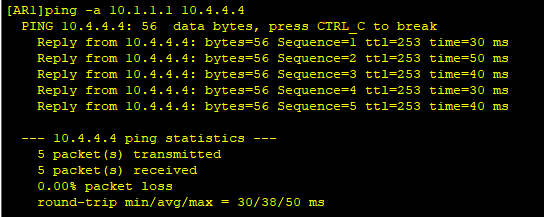

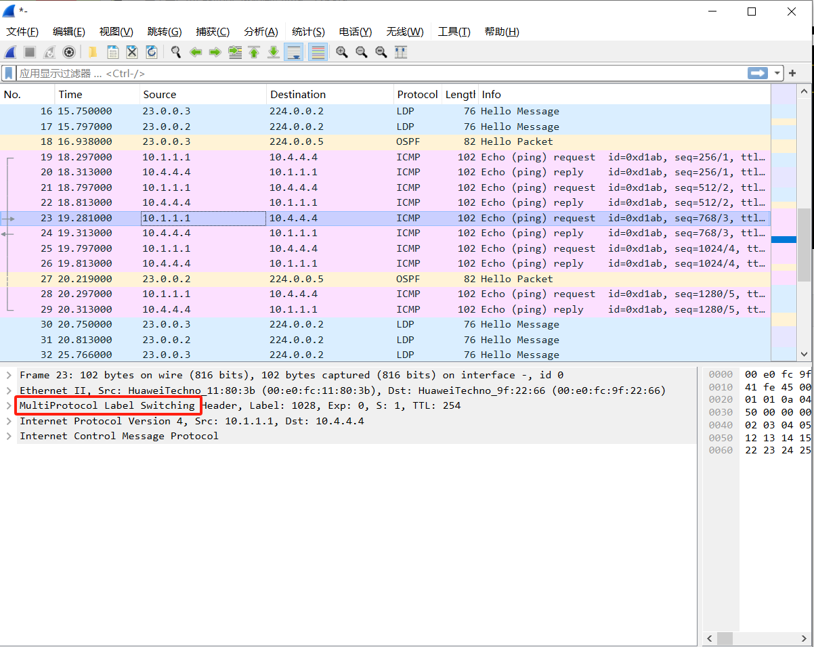