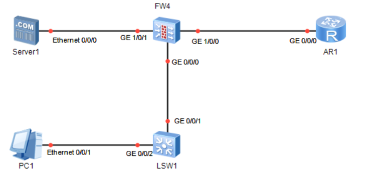

# 二十五、防火墙基础配置

## 重要配置命令

```bash
[FW] firewall zone trust # 进入防火墙的 trust 区域
[FW-zone-trust] add interface GigabitEthernet 1/0/0 # 添加端口 g1/0/0
[FW] firewall zone untrust # 进入防火墙的 untrust 区域
[FW-zone-untrust] add interface GigabitEthernet 1/0/1 # 添加端口 g1/0/1
[FW] firewall zone dmz # 进入防火墙的 DMZ 区域
[FW-zone-dmz] add interface GigabitEthernet 1/0/2 # 添加端口 g1/0/2
[FW] security-policy # 创建安全策略
[FW-policy-security] rule name linsirNB # 规则名为 linsirNB
[FW-policy-security-rule-linsirNB] source-address 192.168.1.0 24 # 源地址为 192.168.1.0/24
[FW-policy-security-rule-linsirNB] source-zone trust # 源区域为 trust 区域
[FW-policy-security-rule-linsirNB] destination-zone untrust # 目的区域为 untrust 区域
[FW-policy-nat-rule-linsirNB] service protocol tcp destination-port 80 # 允许访问的目标端口为 TCP 80
[FW-policy-security-rule-linsirNB] action permit # 执行行为为允许
[FW] nat-policy # 创建 NAT 策略
[FW-policy-nat] rule name linsirNB # 规则名为 linsirNB
[FW-policy-nat-rule-linsirNB] source-address 192.168.1.0 mask 255.255.255.0 # 源地址为 192.168.1.0/24
[FW-policy-nat-rule-linsirNB] source-zone trust # 源区域为 trust 区域
[FW-policy-nat-rule-linsirNB] egress-interface GigabitEthernet 1/0/1 # 出接口为 g1/0/1
[FW-policy-nat-rule-linsirNB] action source-nat easy-ip # 执行基于 easy-ip 的 NAT 转换
[FW-policy-nat-rule-linsirNB] action source-nat address-group 1 # 执行基于 address-group 地址池的 NAT 转换
[FW] nat address-group 1 # 建立 nat 地址池 address-group 1
[FW-address-group-1] section 192.168.1.11 192.168.1.100 # nat 地址池范围为 192.168.1.11-192.168.1.10
```

## 拓扑



## 准备工作


## 步骤

```bash
[FW1] firewall zone trust
[FW1-zone-trust] add interface GigabitEthernet 0/0/0
[FW1] firewall zone untrust
[FW1-zone-untrust] add interface GigabitEthernet 1/0/0
[FW1] firewall zone dmz
[FW1-zone-dmz] add interface GigabitEthernet 1/0/1

# 配置安全模板
[FW1] security-policy
[FW1-policy-security] rule name AM
[FW1-policy-security-rule-AM] source-address 192.168.1.0 24
[FW1-policy-security-rule-AM] destination-zone untrust
[FW1-policy-security-rule-AM] service protocol tcp destination-port 80
[FW1-policy-security-rule-AM] action permit

# 配置NAT模板
[FW1] nat-policy
[FW1-policy-nat] rule name AM
[FW1-policy-nat-rule-AM] source-address 192.168.1.0 mask 255.255.255.0
[FW1-policy-nat-rule-AM] source-zone trust
[FW1-policy-nat-rule-AM] egress-interface GigabitEthernet 1/0/1

[FW1] mat address-group 1
[FW1-adress-grouop-1] section 60.1.1.2 60.1.1.10
```


