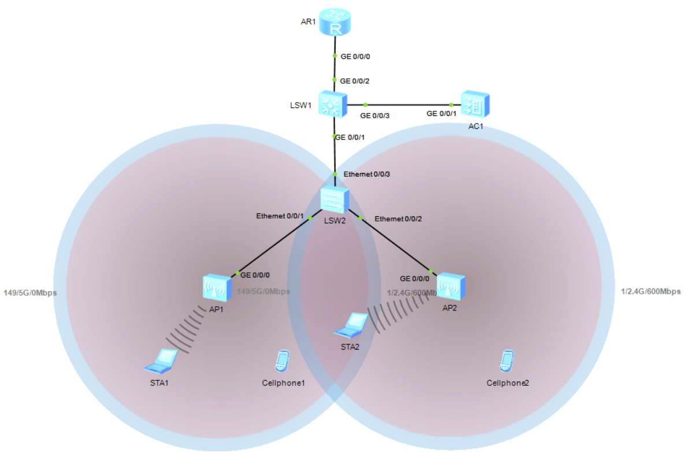
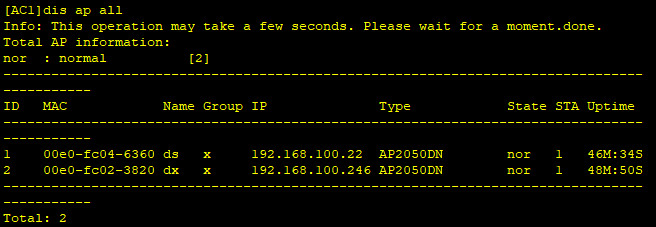
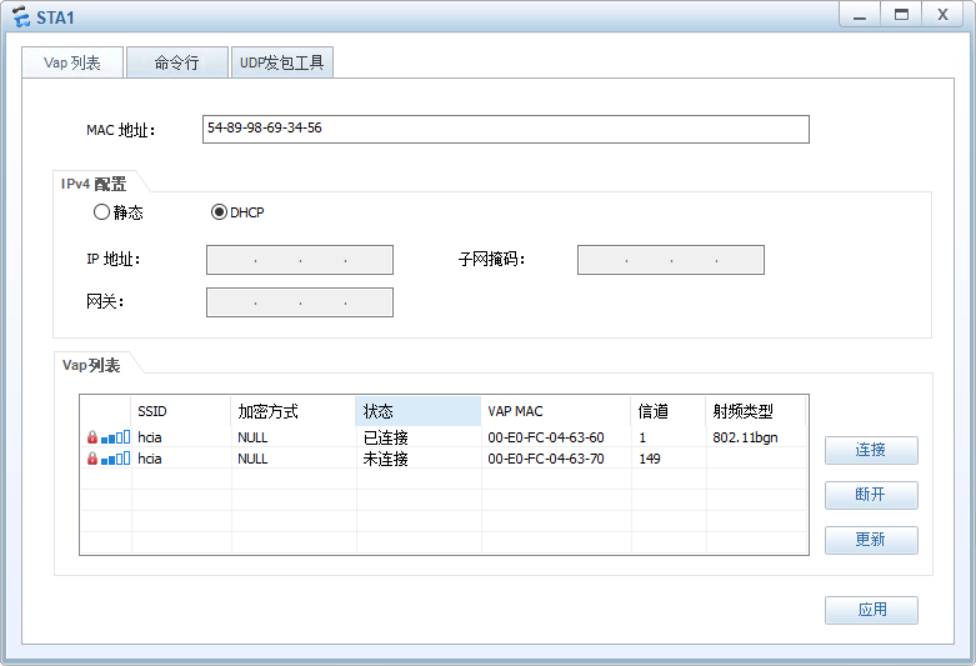
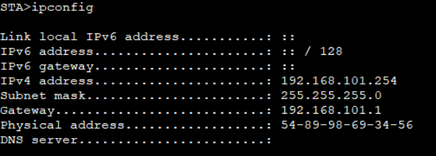
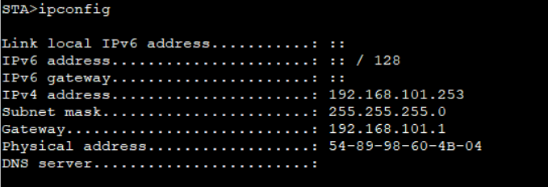
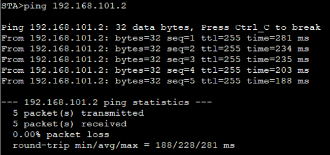

# 二十四、WLAN配置

## 重要配置命令

```bash
[AC] interface vlanif 100 # 进入 vlanif 100 接口
[AC-Vlanif100] ip address 10.23.100.1 24 # 配置 vlanif 100 接口 IP 地址为 10.23.100.1，掩码长度 24 位
[AC] capwap source interface vlanif 100 # capwap 隧道源接口为 vlanif 100
[AC] wlan # 进入 wlan 配置
[AC-wlan-view] regulatory-domain-profile name default # 监控域模板名为 default
[AC-wlan-regulate-domain-default] country-code cn # 国家代码为 cn
[AC-wlan-view] ap-group name ap-group1 # 配置 AP 组名为 ap-group1
[AC-wlan-view] ap auth-mode mac-auth # AP 上线模式为 MAC 地址自动绑定
[AC-wlan-view] ap-id 0 ap-mac 60de-4476-e360 # AP-id 0 绑定地址为 60de-4476-e360
[AC-wlan-ap-0] ap-name area_1 # 该 AP 命名为 area_1
[AC-wlan-ap-0] ap-group ap-group1 # 该 AP 所属组为 ap-group1
[AC-wlan-view] security-profile name wlan-net # 配置安全模板命名为 wlan-net
[AC-wlan-sec-prof-wlan-net] security wpa-wpa2 psk pass-phrase a1234567 aes # 安全认证为 security wpa-wpa2 psk，密钥为 AES 算法 a1234567
[AC-wlan-view] ssid-profile name wlan-net # 创建 SSID 模板命名为 wlan-net
[AC-wlan-ssid-prof-wlan-net] ssid HCIE # 配置 SSID 名称为 HCIE
[AC-wlan-view] vap-profile name wlan-net # 创建名 VAP 模板命名为 wlan-net
[AC-wlan-vap-prof-wlan-net] forward-mode direct-forward # 转发模式为直接转发
[AC-wlan-vap-prof-wlan-net] service-vlan vlan-id 101 # 配置业务 vlan 101
[AC-wlan-vap-prof-wlan-net] security-profile wlan-net # 引用安全模板
[AC-wlan-vap-prof-wlan-net] ssid-profile wlan-net # 引用 SSID 模板
[AC-wlan-view] ap-group name ap-group1 # 配置 AP 组引用 VAP 模板
[AC-wlan-ap-group-ap-group1] vap-profile wlan-net wlan 1 radio 0 # AP 射频 0 调用 VAP 模板 wlan-ne
```

## 拓扑



## 准备工作

VLAN100：管理VLAN

VLAN200：业务VLAN

## 步骤

1. 先配置VLAN

```bash
[LSW2] vlan 100
[LSW2-vlan100] interface Ethernet 0/0/1
[LSW2-Ethernet0/0/1] port link-type trunk
[LSW2-Ethernet0/0/1] port link-type allow-pass vlan 100
[LSW2-Ethernet0/0/1] port trunk pvid vlan 100
[LSW2-Ethernet0/0/1] interface Ethernet0/0/2
[LSW2-Ethernet0/0/2] port link-type trunk
[LSW2-Ethernet0/0/2] port link-type allow-pass vlan 100
[LSW2-Ethernet0/0/2] port trunk pvid vlan 100
[LSW2-Ethernet0/0/2] interface Ethernet0/0/3
[LSW2-Ethernet0/0/2] port link-type trunk
[LSW2-Ethernet0/0/2] port link-type allow-pass vlan 100

[LSW1] vlan batch 100 200
[LSW1-vlan100] interface GigabitEthernet 0/0/1
[LSW1-GigabitEthernet0/0/1] port link-type trunk
[LSW1-GigabitEthernet0/0/1] port link-type allow-pass vlan 100
[LSW1-GigabitEthernet0/0/1] interface GigabitEthernet0/0/3
[LSW1-GigabitEthernet0/0/3] port link-type trunk
[LSW1-GigabitEthernet0/0/3] port link-type allow-pass vlan 100 200
[LSW1-GigabitEthernet0/0/2] interface Ethernet0/0/3
[LSW1-GigabitEthernet0/0/3] port link-type access
[LSW1-GigabitEthernet0/0/3] port default vlan 200
[LSW1] int Vlanif 200
[LSW1-Vlanif200] ip address 192.168.200.1 24

[AC1] vlan batch 100 200
[AC1] interface GigabitEthernet 0/0/1
[AC1-GigabitEthernet0/0/1] port link-type trunk
[AC1-GigabitEthernet0/0/1] port trunk allow-pass vlan 100 200
[AC1-GigabitEthernet0/0/1] quit
[AC1] intface Vlanif 100
[AC1] ip address 192.168.100.1 24
```

2. 在AR1上创建IP地址

```bash
[AR1] interface GigabitEthernet 0/0/1
[AR1-GigabitEthernet0/0/1] ip address 192.168.200.2 24
```

3. 设置DHCP

```bash
[LSW1] dhcp enable
[LSW1] interface Vlanif 200
[LSW1-Vlanif200] dhcp select interface

[AC1] dhcp enable
[AC1] interface Vlanif 100
[AC1-Vlanif100] dhcp select interface
```

4. 在AC上配置，以达到管理AP的目的

```bash
[AC1] wlan
[AC1-wlan-view] ap-group name x  
[AC1-wlan-ap-group-x] quit
[AC1-wlan-view] regulatory-domain-profile name x1
[AC1-wlan-regulate-domain-x1] country-code cn
[AC1-wlan-regulate-domain-x1] quit
[AC1-wlan-view] ap-group name x    
[AC1-wlan-ap-group-x] regulatory-domain-profile x1 

# 配置AC的接口源地址
[AC1] capwap source interface vlanif 100

# 离线导入AP
[AC1] wlan
[AC1-wlan-view] ap auth-mode mac-auth  
[AC1-wlan-view] ap-id 1 ap-mac 00e0-fc04-6360 # AP的mac地址可以在AP1上使用 display interface G0/0/0查看
[AC1-wlan-ap-1] ap-name ds
[AC1-wlan-ap-1] ap-group x
[AC1-wlan-view] ap-id 2 ap-mac 00e0-fc02-3820 # AP的mac地址可以在AP1上使用 display interface G0/0/0查看
[AC1-wlan-ap-1] ap-name dx
[AC1-wlan-ap-1] ap-group x
```

此时可以查看配置是否成功

```bash
[AC1] display ap all
```



5. 成功以后，开始配置WLAN的一些业务参数

```bash
# 创建安全模板
[AC1] wlan
[AC1-wlan-view] security-profile name y1  
[AC1-wlan-sec-prof-y1] security wpa-wpa2 psk pass-phrase hw123456 aes
[AC1-wlan-sec-prof-y1] quit

# 创建SSID模板
[AC1-wlan-view] ssid-profile name y2
[AC1-wlan-ssid-prof-y2] ssid hcia
[AC1-wlan-ssid-prof-y2] quit
[AC1-wlan-view] quit

# 创建VAP模板
[AC1] wlan
[AC1-wlan-view] vap-profile name y
[AC1-wlan-vap-prof-y] forward-mode tunnel
[AC1-wlan-vap-prof-y] service-vlan vlan-id 101
[AC1-wlan-vap-prof-y] security-profile y1
[AC1-wlan-vap-prof-y] ssid-profile y2
[AC1-wlan-vap-prof-y] quit

# 在AP组调用VAP模板
[AC1-wlan-view] ap-group name x
[AC1-wlan-ap-group-x] vap-profile y wlan 1 radio 0
[AC1-wlan-ap-group-x] vap-profile y wlan 1 radio 1
[AC1-wlan-ap-group-x] quit
```

6. 配置完成后，就可以看到两台AP出现了圆圈，同时点击STA，输入连接账号和密码，同时查看是否能获得IP地址







也可以去pingAR1看看是否能ping成功

