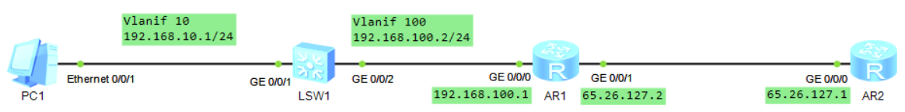
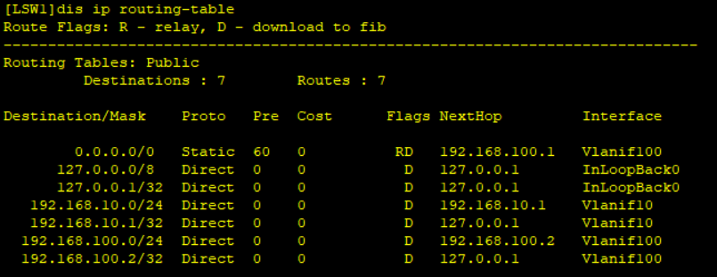
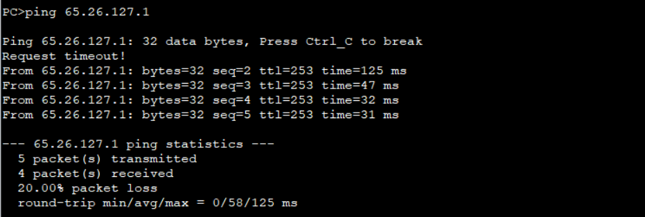
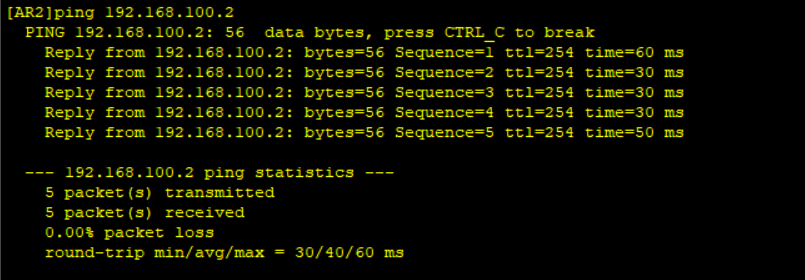

# 五、静态路由与动态路由

## 重要配置命令

```bash
[Huawei] ip route-static 192.168.10.0 24 192.168.100.2 # 到达 192.168.10.0/24 网段的下一跳为 192.168.100.2
[Huawei] ip route-static 0.0.0.0 0 192.168.100.1 # 到达所有网段的下一跳为 192.168.100.1
[Huawei] ip route-static 192.168.10.0 24 192.168.100.2 preference 20 # 到达 192.168.10.0/24 网段的下一跳为 192.168.100.2，路由优先级为 20
```

## 拓扑



## 准备工作

| 设备名称 |     IP地址     |     网关     |
| :------: | :------------: | :----------: |
|   PC1    | 192.168.10.100 | 192.168.10.1 |

## 步骤

1. 先配置`LSW1`的vlan和vlanif

```bash
# 配置端口0/0/1
[LSW1] vlan 10
[LSW1-vlan10] interface Vlanif 10
[LSW1-Vlanif10] ip address 192.168.10.1 24
[LSW1-Vlanif10] quit
[LSW1] interface GigabitEthernet 0/0/1
[LSW1-GigabitEthernet0/0/1] port link-type access
[LSW1-GigabitEthernet0/0/1] port default vlan 10
# 配置端口0/0/2
[LSW1] vlan 100
[LSW1-vlan100] interface Vlanif 100
[LSW1-Vlanif100] ip address 192.168.100.2 24
[LSW1-Vlanif100] interface GigabitEthernet 0/0/2
[LSW1-GigabitEthernet0/0/2] port link-type access
[LSW1-GigabitEthernet0/0/2] port default vlan 100
```

2. 配置AR1和AR2

```bash
[AR1] interface GigabitEthernet 0/0/0
[AR1-GigabitEthernet0/0/0] ip address 192.168.100.1 24
[AR1-GigabitEthernet0/0/0] interface GigabitEthernet 0/0/1
[AR1-GigabitEthernet0/0/1] ip address 65.26.127.2 24

[AR2] interface GigabitEthernet 0/0/0
[AR2-GigabitEthernet0/0/0] ip address 65.26.127.1 24
```

3. 配置默认路由

```bash
[LSW1] ip route-static 0.0.0.0 0 192.168.100.1

[AR1] ip route-static 0.0.0.0 0 65.26.127.1
```

4. 数据要有去有回，【步骤3】只是配置了去的数据

```bash
[AR2] ip route-static 192.168.10.0 24 65.26.127.2

[AR1] ip route-static 192.168.10.0 24 192.168.100.2 
```

配置完成以后，在LSW1上使用`display ip routing-table`查看是否配置成功



可以用PC1去pingAR2



但是，AR2去pingPC1是不通的，因为AR2没有LSW1与AR1之间的路由，要想通，就可以直接配一条AR2到PC1的路由即可

```bash
[AR2] ip route-static 192.168.100.0 24 65.26.127.2
```

此时再去pingPC1，即可通了

