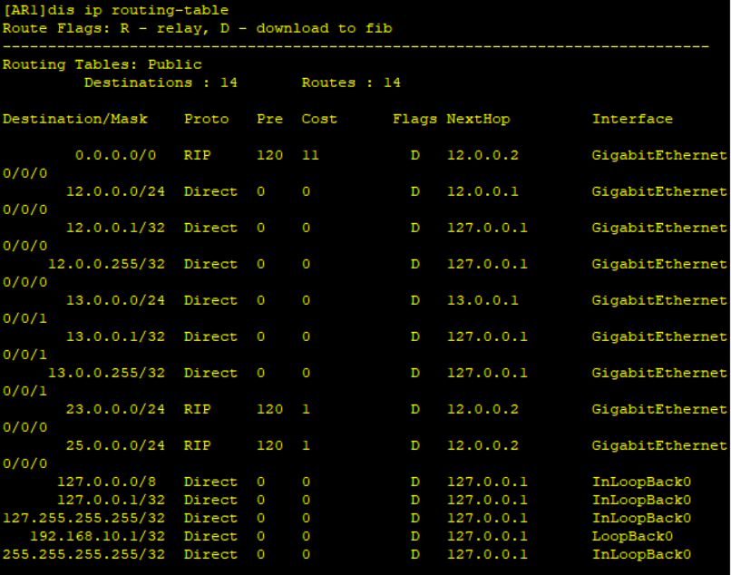

# 八、RIP路由协议配置

## 重要配置命令

```bash
[Huawei] rip 1 # 配置 rip 协议进程 1
[Huawei-rip-1] version 2 # 配置 RIP 版本 2
[Huawei-rip-1] network 12.0.0.0 # 宣告 12.0.0.0 网段
[Huawei-rip-1] preference 100 # 修改路由优先级为 100
[Huawei-GigabitEthernet0/0/1] rip metricin 1 # 设置接口在接收路由时增加的度量值
[Huawei-GigabitEthernet0/0/1] rip metricout 1 # 设置接口在发布路由时增加的度量值
[Huawei-rip-1] summary always # RIP 自动路由聚合
[Huawei-GigabitEthernet0/0/1] rip summary-address 192.168.0.0 255.255.0.0 # 发布聚合路由 192.168.0.0/16
[Huawei-rip-1] default-route originate cost 5 # 下发默认路由且 cost 值为 5
[Huawei-rip-1] silent-interface GigabitEthernet 0/0/1 # 配置 g0/0/1 为抑制接口

[Huawei] acl 2000 # 创建 acl 2000
[Huawei-acl-basic-2000] rule deny source 192.168.30.0 0.0.0.255 # 丢弃源地址段为 192.168.30.0/24 的路由
[Huawei-rip-1] filter-policy 2000 export # 调用 acl 2000 的发布路由方向的过滤列表
[Huawei-rip-1] filter-policy 2000 import # 调用 acl 2000 的接收路由方向的过滤列表
[Huawei-GigabitEthernet0/0/1] rip authentication-mode # 配置 rip 认证（后续需带有参数）
# 注：rip 认证参数包括认证模式为 simple、md5、hmac-sha256；口令模式为 plain：明文、cipher：密文
```

## 拓扑


## 步骤

1. 先配置AR1、AR2、AR3

```bash
[AR1] interface LoopBack 0
[AR1-LoopBack0] ip address 192.168.10.1 32
[AR1-LoopBack0] interface GigabitEthernet 0/0/0
[AR1-GigabitEthernet0/0/0] ip address 12.0.0.1 24
[AR1-GigabitEthernet0/0/0] interface GigabitEthernet 0/0/1
[AR1-GigabitEthernet0/0/1] ip address 13.0.0.1 24

[AR2] interface GigabitEthernet 0/0/0
[AR2-GigabitEthernet0/0/0] ip address 12.0.0.2 24
[AR2-GigabitEthernet0/0/0] interface GigabitEthernet 0/0/2
[AR2-GigabitEthernet0/0/2] ip address 23.0.0.2 24

[AR3] interface GigabitEthernet 0/0/2
[AR3-GigabitEthernet0/0/2] ip address 23.0.0.3 24
[AR3-GigabitEthernet0/0/2] interface GigabitEthernet 0/0/1
[AR3-GigabitEthernet0/0/1] ip address 13.0.0.3 24
[AR3-GigabitEthernet0/0/1] interface LoopBack 0
[AR3-LoopBack0] ip address 192.168.30.1 32
```

2. 在AR1、AR2、AR3上配置RIP

```bash
[AR1] rip 1
[AR1-rip-1] version 2
[AR1-rip-1] network 12.0.0.0
[AR1-rip-1] network 13.0.0.0
[AR1-rip-1] network 192.168.10.0

[AR2] rip 1
[AR2-rip-1] version 2
[AR2-rip-1] network 12.0.0.0
[AR2-rip-1] network 23.0.0.0

[AR3] rip
[AR3-rip-1] version 2
[AR3-rip-1] network 23.0.0.0
[AR3-rip-1] network 13.0.0.0
[AR3-rip-1] network 192.168.30.0
```

3. 使用`display ip routing-table`可以查看配置


4. 如果需要改优先级，可以用一下命令进行修改

```bash
[AR1] rip 1
[AR1-rip-1] preference 120
```


5. 现在AR1是通过GigabitEthernet0/0/1传递数据给AR3，现在修改cost值让AR1的数据从GigabitEthernet0/0/0传递。

```bash
[AR3] interface GigabitEthernet 0/0/1
[AR3-GigabitEthernet0/0/1] rip metricout 5
```


这样，AR1就完成了更改路径的操作

6. 如果要使用路由聚合的话，需要在发布路由的设备上进行配置

```bash
[AR3] rip
[AR3-rip-1] summary always
```


可以看到子网掩码变成24了

当然，除了自动聚合以外，也可以手动聚合

```bash
[AR3] interface GigabitEthernet 0/0/1
[AR3-GigabitEthernet0/0/1] rip summary-address 192.168.30.0  255.255.255.252
```


7. 修改下发默认路由cost值

操作前，需要更改一下拓扑图，同时给AR2增加一个二层接口g4/0/0


```bash
[AR2] interface GigabitEthernet 4/0/0
[AR2-GigabitEthernet4/0/0] ip address 25.0.0.2 24
[AR2-GigabitEthernet4/0/0] quit
[AR2] ip route-static 0.0.0.0 0 25.0.0.5
[AR2] rip 
[AR2-rip-1] default-route originate cost 10
```

此时，AR1和AR3上就会多了一条有邻居分发的默认路由，cost值为11


8. 抑制接口

要得先改一下设备


其中，PC1的ip为25.0.0.1/24，网关是25.0.0.2

先配置AR2

```bash
[AR2] rip
[AR2-rip-1] network 25.0.0.0
```

此时用PC1去pingAR1的换回路由，是可以ping通的，然后去抓包，会发现rip会隔一段时间就发送一段Response报文，对于PC来说是没有意义的。因此就可以把接口配置成抑制接口

```bash
[AR2-rip-1]silent-interface GigabitEthernet 4/0/0
```

8. 调用ACL进行路由过滤

要让AR1不想收到30网段的数据

```bash
[AR3] acl 2000
[AR3-acl-basic-2000] rule deny source 192.168.30.0 0.0.0.255
[AR3-acl-basic-2000] rule permit source any
[AR3-acl-basic-2000] quit
[AR3] rip
[AR3-rip-1] filter-policy 2000 export
```

此时查看AR1的路由表，发现已经没有192.168.30.0这段路由了

