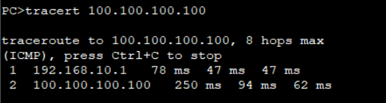

# 六、VRRP配置

## 重要配置命令

```bash
[Huawei-Vlanif10] vrrp vrid 10 virtual-ip 192.168.10.254 # vrrp 组 10 虚拟网关为 192.168.10.254
[Huawei-Vlanif10] vrrp vrid 10 preempt-mode timer delay 10 # 配置 vrrp 组 10 的抢占时间为 20 秒
[Huawei-Vlanif10] vrrp vrid 10 priority 120 # vrrp 组 10 优先级为 120
[Huawei-Vlanif10] vrrp vrid 10 track interface GigabitEthernet0/0/1 reduced 50 # vrrp 组 10 开启追踪端口g0/0/1，优先级降低 5
```

## 拓扑


## 准备工作

| 设备名称 | IP地址         | 网关           |
| -------- | -------------- | -------------- |
| PC1      | 192.168.10.100 | 192.168.10.254 |
| PC2      | 192.168.20.100 | 192.168.20.254 |
|          |                |                |


## 步骤

1. 先配置LSW3，开通VLAN10、VLAN20

```bash
[LSW3] vlan batch 10 20
# 配置端口1
[LSW3] interface Ethernet 0/0/1
[LSW3-Ethernet0/0/1] port link-type access
[LSW3-Ethernet0/0/1] port default vlan 10
# 配置端口2
[LSW3-Ethernet0/0/1] interface Ethernet 0/0/2
[LSW3-Ethernet0/0/2] port link-type access
[LSW3-Ethernet0/0/2] port default vlan 20
# 配置端口3
[LSW3-Ethernet0/0/2] interface Ethernet 0/0/3
[LSW3-Ethernet0/0/3] port link-type trunk 
[LSW3-Ethernet0/0/3] port trunk allow-pass vlan all
# 配置端口4
[LSW3-Ethernet0/0/3] interface Ethernet 0/0/4
[LSW3-Ethernet0/0/4] port link-type trunk
[LSW3-Ethernet0/0/4] port trunk allow-pass vlan all
```

2. 配置LSW1、LSW2的VLAN

``` bash
[LSW1] vlan batch 10 20 99
[LSW1] interface GigabitEthernet 0/0/1
[LSW1-GigabitEthernet0/0/1] port link-type trunk
[LSW1-GigabitEthernet0/0/1] port trunk allow-pass vlan all
[LSW1-GigabitEthernet0/0/1] interface Vlanif 99
[LSW1-Vlanif99] ip address 14.0.0.1 24
[LSW1-Vlanif99] interface GigabitEthernet 0/0/2
[LSW1-GigabitEthernet0/0/2] port link-type access
[LSW1-GigabitEthernet0/0/2] port default vlan 99

[LSW2] vlan batch 10 20 99
[LSW2] interface GigabitEthernet 0/0/1
[LSW2-GigabitEthernet0/0/1] port link-type trunk
[LSW2-GigabitEthernet0/0/1] port trunk allow-pass vlan all
[LSW2-GigabitEthernet0/0/1] interface Vlanif 99
[LSW2-Vlanif99] ip address 24.0.0.2 24
[LSW2-Vlanif99] interface GigabitEthernet 0/0/2
[LSW2-GigabitEthernet0/0/2] port link-type access
[LSW2-GigabitEthernet0/0/2] port default vlan 99
```

3. 配置LSW1、LSW2的默认路由

```bash
[LSW1] ip route-static 0.0.0.0 0 14.0.0.4

[LSW2] ip route-static 0.0.0.0 0 24.0.0.4
```

4. 配置AR1

```bash
[AR1] interface GigabitEthernet 0/0/0
[AR1-GigabitEthernet0/0/0] ip address 14.0.0.4 24
[AR1-GigabitEthernet0/0/0] interface GigabitEthernet 0/0/1
[AR1-GigabitEthernet0/0/1] ip address 24.0.0.4 24

[AR1] ip route-static 192.168.10.0 24 14.0.0.1
[AR1] ip route-static 192.168.20.0 24 14.0.0.1
[AR1] ip route-static 192.168.10.0 24 24.0.0.2
[AR1] ip route-static 192.168.20.0 24 24.0.0.2

[AR1] interface LoopBack 0
[AR1-LoopBack0] ip address 100.100.100.100 32
```

5. 开始配置VRRP

```bash
[LSW1] interface Vlanif 10
[LSW1-Vlanif10] ip address 192.168.10.1 24
[LSW1-Vlanif10] vrrp vrid 10 virtual-ip 192.168.10.254
[LSW1-Vlanif10] vrrp vrid 10 priority 120
[LSW1-Vlanif10] interface Vlanif 20
[LSW1-Vlanif20] ip address 192.168.20.1 24
[LSW1-Vlanif20] vrrp vrid 20 virtual-ip 192.168.20.254
[LSW1-Vlanif20] vrrp vrid 20 priority 80

[LSW2] interface Vlanif 10
[LSW2-Vlanif10] ip address 192.168.10.2 24
[LSW2-Vlanif10] vrrp vrid 10 virtual-ip 192.168.10.254
[LSW2-Vlanif10] vrrp vrid 10 priority 80
[LSW2-Vlanif10] interface Vlanif 20
[LSW2-Vlanif20] ip address 192.168.20.2 24
[LSW2-Vlanif20] vrrp vrid 20 virtual-ip 192.168.20.254
[LSW2-Vlanif20] vrrp vrid 20 priority 120
```

可以使用`display vrrp brief`查看是否有配置成功


在PC1、PC2分别使用命令`tracert 100.100.100.100`




可以看到，PC1的数据走LSW1，PC2的数据走LSW2


::: info 小知识

使用以下命令可以看到详细的VRRP设置

```bash
[LSW1] display vrrp
```


`PriorityRun`：设备运行优先级

`PriorityConfig`：设置设备优先级

`MasterPriority`：主设备优先级，某台设备被选举成为主设备

一般来说`PriorityRun`和`PriorityConfig`是一样的，但是也有特殊情况。就是如果Vlan的地址和Vlanif的地址是一样的花，`PriorityRun`会变成255，`PriorityConfig`还是和配置的时候是一样的。

:::

6. 配置上行链路追踪

如果，LSW1的G0/0/2接口断开了，或者AR1的G0/0/0接口断开了，就会进入路由黑洞，PC1的流量就不会自动切换，所以要在交换机上配置上行链路追踪。

```bash
[LSW1] interface Vlanif 10
[LSW1-Vlanif10] vrrp vrid 10 track interface GigabitEthernet 0/0/2 reduced 50
```

此时断开AR1的G0/0/0接口

```bash
[AR1] interface GigabitEthernet 0/0/0
[AR1-GigabitEthernet0/0/0] shutdown
```

使用`tracer 100.100.100.100`观察PC1流量路径


可以发现，此时路径往LSW2走了。

