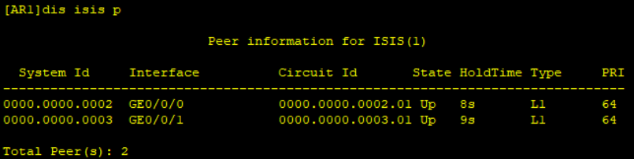
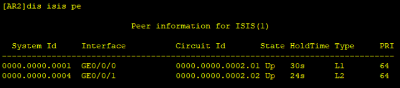
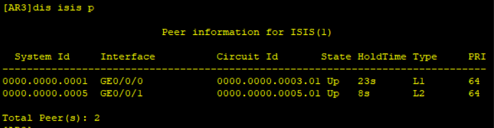
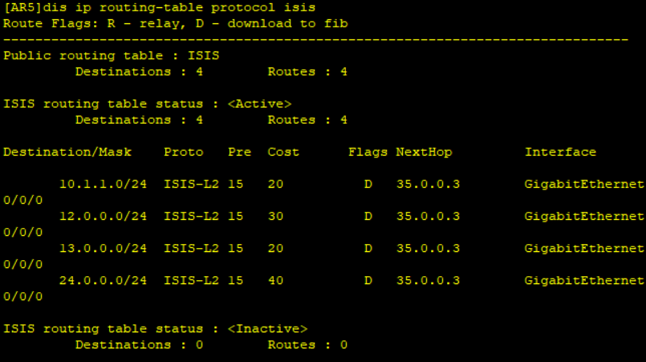
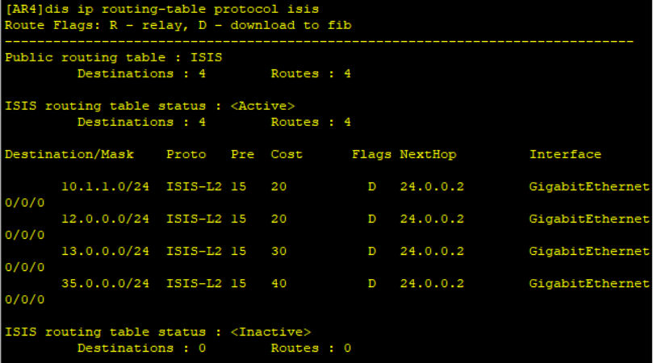
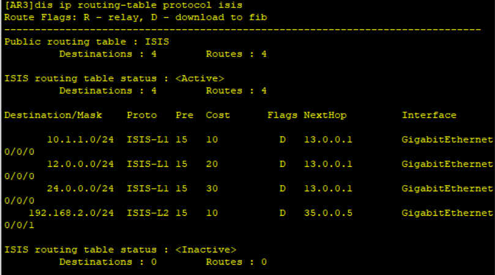
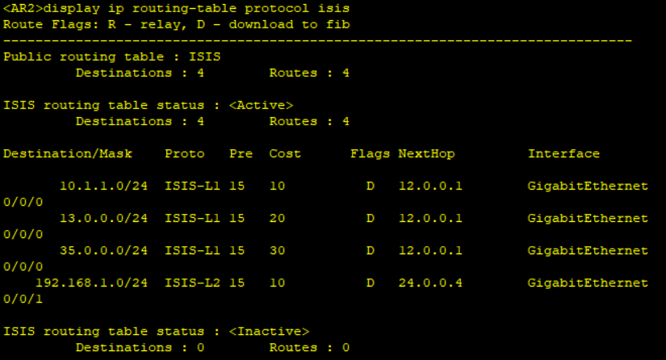
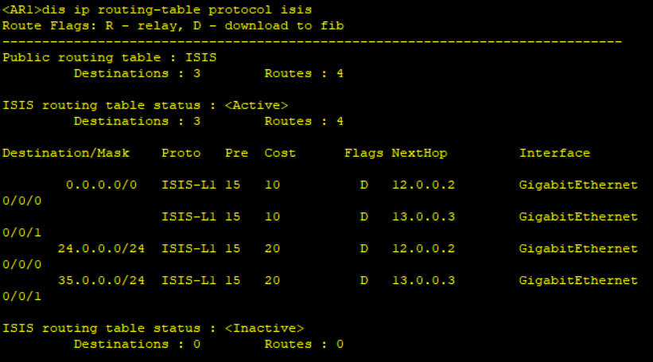
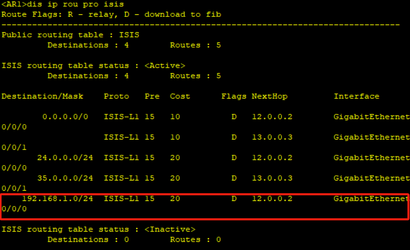

# 十、ISIS配置

## 重要配置命令

```bash
[Huawei] isis 1 # 配置 ISIS 协议进程 1
[Huawei-isis-1] network-entity 49.0000.0000.0000.0001.00 # 配置 NET 地址为 49.0000.0000.0000.0001.00
[Huawei-isis-1] is-level level-1 # 配置 ISIS 路由器为 level-1 设备
[Huawei-GigabitEthernet0/0/0] isis enable # 在 g0/0/0 接口运行 ISIS 路由协议
[Huawei-isis-1] preference 100 # 修改路由优先级为 100
[Huawei-GigabitEthernet0/0/1] isis cost 10 # 修改 isis 的接口 cost 为 10
[Huawei-isis-1] summary 10.1.0.0 255.255.0.0 # 配置聚合路由为 10.1.0.0 255.255.0.0
[Huawei-isis-1] default-route-advertise always cost 5 # 始终下发默认路由且 cost 值为 5
[Huawei] acl 2000 # 创建 acl 2000
[Huawei-acl-basic-2000] rule deny source 10.1.1.0 0.0.0.255 # 对源地址段为 10.1.1.0 的路由执行丢弃
[Huawei-isis-1] filter-policy 2000 import # 调用 acl 2000 的接收路由方向的过滤列
```

## 拓扑


## 步骤

1. 配置路由接口

```bash
[AR1] interface LoopBack 0
[AR1-LoopBack0] ip address 10.1.1.1 24
[AR1-LoopBack0] interface GigabitEthernet 0/0/0
[AR1-GigabitEthernet0/0/0] ip address 12.0.0.1 24
[AR1-GigabitEthernet0/0/0] interface GigabitEthernet 0/0/1
[AR1-GigabitEthernet0/0/1] ip address 13.0.0.1 24

[AR2] interface GigabitEthernet 0/0/0
[AR2-GigabitEthernet0/0/0] ip address 12.0.0.2 24
[AR2-GigabitEthernet0/0/0] interface GigabitEthernet 0/0/1
[AR2-GigabitEthernet0/0/1] ip address 24.0.0.2 24

[AR3] interface GigabitEthernet 0/0/0
[AR3-GigabitEthernet0/0/0] ip address 13.0.0.3 24
[AR3-GigabitEthernet0/0/0] interface GigabitEthernet 0/0/1
[AR3-GigabitEthernet0/0/1] ip address 35.0.0.3 24

[AR4] interface GigabitEthernet 0/0/0
[AR4-GigabitEthernet0/0/0] ip address 24.0.0.4 24
[AR4-GigabitEthernet0/0/0] interface LoopBack 0
[AR4-LoopBack0] ip address 192.168.1.100 24

[AR5]interface GigabitEthernet 0/0/0
[AR5-GigabitEthernet0/0/0] ip address 35.0.0.5 24
[AR5-GigabitEthernet0/0/0] interface LoopBack 0
[AR5-LoopBack0] ip address 192.168.2.100 24
```

2. 配置isis

```bash
[AR1] isis
[AR1-isis-1] network-entity 49.0001.0000.0000.0001.00
[AR1-isis-1] is-level level-1
[AR1-isis-1] quit
[AR1] interface GigabitEthernet 0/0/0
[AR1-GigabitEthernet0/0/0] isis enable
[AR1-GigabitEthernet0/0/0] interface GigabitEthernet 0/0/1
[AR1-GigabitEthernet0/0/1] isis enable
[AR1-GigabitEthernet0/0/1] interface LoopBack 0
[AR1-LoopBack0] isis enable

[AR2] isis 1
[AR2-isis-1] network-entity 49.0001.0000.0000.0002.00
[AR2-isis-1] is-level level-1-2
[AR2-isis-1] interface GigabitEthernet 0/0/0
[AR2-GigabitEthernet0/0/0] isis enable
[AR2-GigabitEthernet0/0/0] interface GigabitEthernet 0/0/1
[AR2-GigabitEthernet0/0/1] isis enable

[AR3] isis 1
[AR3-isis-1] network-entity 49.0001.0000.0000.0003.00
[AR3-isis-1] is-level level-1-2
[AR3-isis-1] interface GigabitEthernet 0/0/0
[AR3-GigabitEthernet0/0/0] isis enable
[AR3-GigabitEthernet0/0/0] interface GigabitEthernet 0/0/1
[AR3-GigabitEthernet0/0/1] isis enable

[AR4] isis 1
[AR4-isis-1] network-entity 49.0002.0000.0000.0004.00
[AR4-isis-1] is-level level-2
[AR4-isis-1] interface GigabitEthernet 0/0/0
[AR4-GigabitEthernet0/0/0] isis enable
[AR4-GigabitEthernet0/0/0] interface LoopBack 0
[AR4-LoopBack] isis enable

[AR5] isis 1
[AR5-isis-1] network-entity 49.0002.0000.0000.0005.00
[AR5-isis-1] is-level level-2
[AR5-isis-1] interface GigabitEthernet 0/0/0
[AR5-GigabitEthernet0/0/0] isis enable
[AR5-GigabitEthernet0/0/0] interface LoopBack 0
[AR5-LoopBack] isis enable
```

配置完成后，可以使用`display isis peer`查看是否配置成功







同时，也可以查看各个路由的路由表

```bash
[Huawei] display ip routing-table protocol isis
```











可以看到，AR1上只有寥寥几条的路由，这是为什么呢？

这个其实和Level 1的特性有关。这个Level 1区域有点类似与OSPF的stub区域。ISIS路由协议一般是用于运营商环境。一般站点路由会划分为Level 1，而这些站点路由只需要一些默认路由即可，它并不需要知道骨干网路由的明细。

那就是想要知道怎么办？可以使用路由渗透

在中间节点路由上配置如下命令即可：

```bash
[AR2] isis
[AR2-isis-1] import-route isis level-2 into level-1 
```

此时查看AR1的路由表



