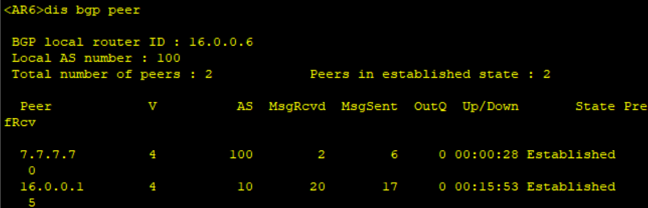
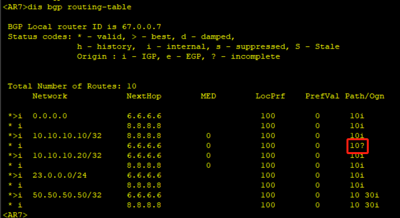

# 十一、BGP路由协议配置

## 重要配置命令

```bash
[Huawei] bgp 100 # 配置 BGP 的 AS 域 100
[Huawei-bgp] router-id 1.1.1.1 # 配置 router-id 为 1.1.1.1
[Huawei-bgp] peer 2.2.2.2 as-number 100 # 配置 EBGP 对等体为 2.2.2.2，AS 号为 100
[Huawei-bgp] network 10.10.10.10 32 # 通告 10.10.10.10/32 网段的路由
[Huawei-bgp] peer 2.2.2.2 next-hop-local # 对 2.2.2.2 配置下一跳为本地
[Huawei-bgp] peer 2.2.2.2 connect-interface LoopBack 0 # 对 2.2.2.2 配置更新源接口为环回接口 LoopBack 0
[Huawei-bgp] peer 2.2.2.2 reflect-client # 配置对 2.2.2.2 的路由反射器

[Huawei-bgp] preference 200 100 100 # 配置 EBGP 路由优先级 200，IBGP 路由优先级 100，本地产生的路由优先级 100

[Huawei-bgp] aggregate 10.10.0.0 16 as-set # 配置聚合路由为 10.10.0.0/16 且携带 AS 属性

[Huawei-bgp] peer 2.2.2.2 default-route-advertise # 对 2.2.2.2 下发默认路由

[Huawei] acl 2000 # 创建 acl 2000
[Huawei-acl-basic-2000] rule deny source 10.10.10.0 0.0.0.255 # 对源地址段为 10.10.10.0/24 的路由执行丢弃
[Huawei-bgp] filter-policy 2000 import # 调用 acl 2000 的接收路由方向的过滤列表
[Huawei-bgp] default local-preference 150 # 修改默认的本地优先级为 150

[Huawei] route-policy 1 permit node 1 # 创建路由策略列表 1，放行规则 1
[Huawei-route-policy] if-match acl 2000 # 匹配 ACL 2000
[Huawei-route-policy] apply cost 100 # 设置 cost 为 100
[Huawei-route-policy] apply origin incomplete # 设置路由起源方式为引入
[Huawei-route-policy] apply local-preference 100 # 设置本地路由优先级为 100
[Huawei-route-policy] apply as-path 200 additive # 设置 AS-PATH 属性列表增加 AS 200
[Huawei-bgp] peer 3.3.3.3 route-policy 1 export # 对 3.3.3.3 对等体通告路由方向调用路由策略

[Huawei-bgp] peer 2.2.2.2 password # 对 2.2.2.2 配置认证（后续需带有参数）
# 注：ospf 认证参数包括认证模式为 simple、md5、hmac-sha256、keychain；口令模式为 plain：明文、cipher：密文
```

## 拓扑


## 准备工作

| 设备名称 | 接口       | IP地址         |
| -------- | ---------- | -------------- |
| AR1      | LoopBack 0 | 1.1.1.1/32     |
|          | LoopBack 1 | 10.10.10.10/32 |
|          | LoopBack 2 | 10.10.10.20/32 |
|          | GE0/0/0    | 13.0.0.1/24    |
|          | GE0/0/1    | 14.0.0.1/24    |
|          | GE3/0/0    | 16.0.0.1/24    |
|          | GE4/0/0    | 18.0.0.1/24    |
| AR2      | LoopBack 0 | 2.2.2.2/32     |
|          | LoopBack 1 | 20.20.20.20/32 |
|          | GE0/0/0    | 23.0.0.2/24    |
| AR3      | LoopBack 0 | 3.3.3.3/24     |
|          | GE0/0/0    | 13.0.0.3/24    |
|          | GE0/0/1    | 23.0.0.3/24    |
| AR4      | LoopBack 0 | 4.4.4.4/32     |
|          | GE0/0/0    | 14.0.0.4/24    |
|          | GE0/0/1    | 45.0.0.4/24    |
| AR5      | LoopBack 0 | 5.5.5.5/32     |
|          | LoopBack 1 | 50.50.50.50/32 |
|          | GE0/0/0    | 45.0.0.5/24    |
| AR6      | LoopBack 0 | 6.6.6.6/32     |
|          | GE0/0/0    | 16.0.0.6/24    |
|          | GE0/0/1    | 67.0.0.6/24    |
| AR7      | LoopBack 0 | 7.7.7.7/32     |
|          | GE0/0/0    | 67.0.0.7/24    |
|          | GE0/0/1    | 78.0.0.7/24    |
| AR8      | LoopBack 0 | 8.8.8.8/32     |
|          | GE0/0/0    | 18.0.0.8/24    |
|          | GE0/0/1    | 78.0.0.8/24    |

## 步骤

### 基础认识

1. 先配置各路由器的IP地址
2. 先建立底层路由，让IBGP互连，此处用OSPF协议

```bash
[AR1] ospf 1
[AR1-ospf-1]area 0
[AR1-ospf-1-area-0.0.0.0]network 13.0.0.0 0.0.0.255
[AR1-ospf-1-area-0.0.0.0]network 14.0.0.0 0.0.0.255
[AR1-ospf-1-area-0.0.0.0]network 1.1.1.1 0.0.0.0

[AR3]ospf 1
[AR3-ospf-1]area 0
[AR3-ospf-1-area-0.0.0.0]network 13.0.0.0 0.0.0.25
[AR3-ospf-1-area-0.0.0.0]net 3.3.3.3 0.0.0.0

[AR4]ospf 1
[AR4-ospf-1]area 0
[AR4-ospf-1-area-0.0.0.0]network 14.0.0.0 0.0.0.255
[AR4-ospf-1-area-0.0.0.0]network 4.4.4.4 0.0.0.0
```

3. 建立iBGP邻居

```bash
[AR1] bgp 10
[AR1-bgp] router-id 1.1.1.1
[AR1-bgp] peer 3.3.3.3 as-number 10
[AR1-bgp] peer 3.3.3.3 connect-interface LoopBack 0
[AR1-bgp] peer 4.4.4.4 as-number 10
[AR1-bgp] peer 4.4.4.4 connect-interface LoopBack 0

[AR3] bgp 10
[AR3-bgp] router-id 3.3.3.3
[AR3-bgp] peer 1.1.1.1 as-number 10
[AR3-bgp] peer 1.1.1.1 connect-interface LoopBack 0
[AR3-bgp] peer 1.1.1.1 next-hop-local

[AR4] bgp 10
[AR1-bgp] router-id 4.4.4.4
[AR4-bgp] peer 1.1.1.1 as-number 10
[AR4-bgp] peer 1.1.1.1 connect-interface LoopBack 0
[AR4-bgp] peer 1.1.1.1 next-hop-local
```

可以使用`display bgp peer`查看是否建立成功


4. 建立EBGP邻居

```bash
[AR3-bgp] peer 23.0.0.2 as-number 20

[AR2] bgp 20
[AR2-bgp] router-id 2.2.2.2
[AR2-bgp] peer 23.0.0.3 as-number 10

[AR4-bgp] peer 45.0.0.5 as-number 30

[AR5] bgp 30
[AR5-bgp] router-id 5.5.5.5
[AR5-bgp] peer 45.0.0.4 as-number 10
```

让 `50.50.50.50/32` 生成BGP路由

```bash
[AR5-bgp] network 50.50.50.50 32
```

此时可以在AR1上看到 `50.50.50.50/32` 这条路由

当然，AR3上是没有的，因此防环机制（水平路由分割）

需要的话，可以在AR1上做反射器，让 `3.3.3.3` 成为自己的客户端

```bash
[AR1] bgp 10
[AR1-bgp] peer 3.3.3.3 reflect-client
```

稍等一会儿，即可在AR3上看到 `50.50.50.50/32` 这条路由


同样，AR2上也能收到 `50.50.50.50/32` 这条路由


但是从AR2上ping `50.50.50.50` 是ping不通的，因为并没有把 `23.0.0.0` 这个网段通告给AR5，只需要在AR3上通告完之后就可以ping通了。

```bash
[AR3-bgp] network 23.0.0.0 24
```

通告完成后，查看AR5的路由表


5. 如果，不在AR1上建立反射的方式传输 `50.50.50.50` ，可以通过AR3和AR4建立一次对等体的方式也可以实现AR3学到 `50.50.50.50` 

```bash
[AR3] bgp 10
[AR3-bgp] peer 4.4.4.4 as-number 10
[AR3-bgp] peer 4.4.4.4 connect-interface LoopBack 0
[AR3-bgp] peer 4.4.4.4 next-hop-local

[AR4] bgp 10
[AR4-bgp] peer 3.3.3.3 as-number 10
[AR4-bgp] peer 3.3.3.3 connect-interface LoopBack 0
[AR4-bgp] peer 3.3.3.3 next-hop-local
```


此时AR2也可以ping通AR5


6. 当然，即使把AR1的BGP配置给删除掉，AR2一样可以学习到 `50.50.50.50` 这条路由

```bash
[AR1] undo bgp 10
```

此时AR1的底层路由是在运行的，可以理解为AR1是一条线，AR2上还可以学习到 `50.50.50.50` 这条路由


但是AR2是 ping 不通AR5的


这其实涉及到BGP同步问题。AR2和AR5不能通信，是因为AR3的BGP路由表里面`50.50.50.50`的下一跳是`4.4.4.4`


而`4.4.4.4`这条路由是通过OSPF选举出来的，而到达`4.4.4.4`的下一跳地址是`13.0.0.1`，也即是AR1上的G0/0/0


而AR1上并没有到达50这个网段的路由，因为50网段的路由是通过BGP生成的


自然，这样可能AR2就不能和AR5通信啦

接着上面的思路，要想`50.50.50.50`在AR1上进入OSPF，就需要在AR4上引入50这个网段。但是一般不会这么做，因为这样就相当于把公网的路由引入到了内部里面，这样既不现实也不安全。

### 路由聚合

1. 先把AR1上的两个环回口宣告到BGP里

```bash
[AR1] bgp 10
[AR1-bgp] network 10.10.10.10 32
[AR1-bgp] network 10.10.10.20 32
# 重新建立对等体
[AR1-bgp] peer 3.3.3.3 as-number 10
[AR1-bgp] peer 3.3.3.3 connect-interface LoopBakc 0
[AR1-bgp] peer 4.4.4.4 as-number 10
[AR1-bgp] peer 4.4.4.4 connect-interface LoopBakc 0
```

2. 在AR1上进行路由聚合

```bash
[AR1-bgp] aggregate 10.10.10.0 24
```

此时查看AR3上的BGP路由表


AR2上也能学到


### 下发默认路由

1. 从AR3指向AR1下发一条默认路由

```bash
[AR3] bgp 10
[AR3-bgp] peer 1.1.1.1 default-route-advertise
```

此时查看AR1的BGP路由表


往后做实验记得先undo掉聚合路由

### 路由过滤

1. 现在想把`10.10.10.10/32`过滤掉

```bash
[AR3] acl 2000
[AR3-acl-basic-2000] rule deny source 10.10.10.10 0.0.0.0
[AR3-acl-basic-2000] rule permit all
[AR3-acl-basic-2000] quit
[AR3] bgp 10
[AR3-bgp] peer 1.1.1.1 filter-policy 2000 import # 对对等体进行调用 acl 2000 的接收路由方向的过滤
```

2. 除了入方向，还可以出方向过滤

```bash
[AR1] acl 2000
[AR1-acl-basic-2000] rule deny source 10.10.10.10 0.0.0.0
[AR1-acl-basic-2000] rule permit all
[AR1-acl-basic-2000] quit
[AR1] bgp 10
[AR1-bgp] peer 3.3.3.3 filter-policy 2000 export
```

此时查看AR3的路由表，可以发现`10.10.10.10`已经被过滤了


### BGP路由选路

1. 先建立BGP对等体

```bash
[AR1] bgp 10
[AR1-bgp] peer 16.0.0.6 as-number 10
[AR1-bgp] peer 18.0.0.8 as-number 10

[AR6] bgp 100
[AR6-bgp] peer 16.0.0.1 as-number 10

[AR8] bgp 100
[AR8-bgp] peer 18.0.0.1 as-number 10
```

2. 开启OSPF，建立底层路由

```bash
[AR6] ospf
[AR6-ospf-1] area 0
[AR6-ospf-1-area-0.0.0.0] network 6.6.6.6 0.0.0.0
[AR6-ospf-1-area-0.0.0.0] network 67.0.0.0 0.0.0.255

[AR7] ospf
[AR7-ospf-1] area 0
[AR7-ospf-1-area-0.0.0.0] quit
[AR7-ospf-1] quit
[AR7] interface GigabitEthernet 0/0/0
[AR7-GigabitEthernet0/0/0] ospf enable area 0
[AR7-GigabitEthernet0/0/0] interface GigabitEthernet 0/0/1
[AR7-GigabitEthernet0/0/1] ospf enable area 0
[AR7-GigabitEthernet0/0/1] interface LoopBack 0
[AR7-LoopBack0] ospf enable area 0

[AR8] ospf
[AR8-ospf-1] area 0
[AR8-ospf-1-area-0.0.0.0] quit
[AR8-ospf-1] quit
[AR8] interface LoopBack 0
[AR8-LoopBack0] ospf enable area 0
[AR8-LoopBack0] interface GigabitEthernet 0/0/1
[AR8-GigabitEthernet0/0/1] ospf enable area 0
```

此时可以查看AR7的OSPF配置表


3. 建立BGP

```bash
[AR6] bgp 100
[AR6-bgp] peer 7.7.7.7 as-number 100
[AR6-bgp] peer 7.7.7.7 connect-interface LoopBack 0
[AR6-bgp] peer 7.7.7.7 next-hop-local

[AR8] bgp 100
[AR8-bgp] peer 7.7.7.7 as-number 100
[AR8-bgp] peer 7.7.7.7 connect-interface LoopBack 0
[AR8-bgp] peer 7.7.7.7 next-hop-local

[AR7] bgp 100
[AR7-bgp] peer 6.6.6.6 as-number 100
[AR7-bgp] peer 6.6.6.6 connect-interface LoopBack 0
[AR7-bgp] peer 8.8.8.8 as-number 100
[AR7-bgp] peer 8.8.8.8 connect-interface LoopBack 0
```

查看BGP对等体是否建立起来




查看AR7的BGP路由表，发现会选择`6.6.6.6`这条路径为最优路径


同时也可以查看IP路由表，可以发现只有`6.6.6.6`这条路由放进了路由表里面。


要想`8.8.8.8`也放进路由表里面，可以使用负载均衡的命令。

```bash
[AR7] bgp 100
[AR7-bgp] maximum load-balancing 2
```


### info cost、origin、local-preference、as-path四个参数

::: info cost、origin、local-preference、as-path四个参数的优先级如何排序？

```bash
[Huawei-route-policy] apply cost 100 # 设置 cost 为 100
[Huawei-route-policy] apply origin incomplete # 设置路由起源方式为引入
[Huawei-route-policy] apply local-preference 100 # 设置本地路由优先级为 100
[Huawei-route-policy] apply as-path 200 additive # 设置 AS-PATH 属性列表增加 AS 200
```

local-preference（路由优先级） > as-path > origin（起源） > cost（ned值）

前三个属性都可以用路由策略工具修改

:::

从上文可知，目前路由优先选择`6.6.6.6`，现在改为优选`8.8.8.8`

#### 更改本地优先级(local-preference)

```bash
[AR8] acl 2000
[AR8-acl-basic-2000] rule permit source 10.10.10.10 0.0.0.0
[AR8-acl-basic-2000] quit
[AR8] route-policy 1 permit node 1
[AR8-route-policy] if-match acl 2000
[AR8-route-policy] apply local-preference 150
[AR8-route-policy] quit
[AR8] bgp 100
[AR8-bgp] peer 7.7.7.7 route-policy 1 export
```

此时在AR7上查看BGP路由表，发现已经最优路由已经更改，同时LocPrf改成了150


同时观察`10.10.10.20`这条路由，会发现它只从AR6那边过来，那是因为在AR8上的过滤列表中并没有新增一个放行规则，导致除了`10.10.10.10`这条路由以外，其他的路由都会被过滤掉，因此需要在过滤列表里面再增添语句。

```bash
[AR8] route-policy 1 permit node 2
```

至此，路由既可以从AR6学过来，也可以从AR8学过来


#### 更改AS-path属性

+ 经过的AS数越少，则优先级越高

+ 当本地优先级相同的时候，就可以修改AS-path属性更改优先级

1. 增大AR8的AS属性，让路由从AR6通过

```bash
[AR8] route-policy 1 permit node 1
[AR8-route-policy] if-match acl 2000
[AR8-route-policy] apply as-path 200 additive
[AR8-route-policy] quit
[AR8] bgp 100
[AR8-bgp] peer 7.7.7.7 route-policy 1 export
```

查看AR7的BGP路由表，会发现此时`8.8.8.8`的Path值已经变大。


### 更改起源方式（origin）

1. 把原来用network方式引入的路由更改成直连路由引入

```bash
[AR1] bgp 10
[AR-bgp] import-route direct
```

此时查看AR7路由表，会发现AR1把所有路由都给到了AR7，因此真实情况下是不建议直接用这种方式引入路由。


2. 除了直接引入的方法，还可以直接更改属性的方式更改起源

```bash
[AR6] acl 2000
[AR6-acl-basic-2000] rule permit source 10.10.10.10 0.0.0.0
[AR6-acl-basic-2000] quit
[AR6] route-policy 1 permit node 1
[AR6-route-policy] if-match acl 2000
[AR6-route-policy] apply origin incomplete
[AR6-route-policy] quit 
[AR6] route-policy 1 permit node 2
[AR6-route-policy] quit
[AR6] bgp 100
[AR6-bgp] peer 7.7.7.7 route-policy 1 export 
```

此时查看AR7的BGP路由表



#### 更改cost值

cost值的修改其实与MED值有关，要想实现这个效果，首先需要通过AR7去分发路由给到AR1，然后再去更改MED值来实现路由路径优选

1. 先在AR7上启用一个虚拟接口，然后通过BGP分发路由

```bash
[AR7] interface LoopBack 1
[AR7-LoopBack1] ip address 70.70.70.70
[AR7-LoopBack1] quit
[AR7] bgp 100
[AR7-bgp] network 70.70.70.70 32
```

2. 在AR8和AR6上启用路由过滤列表，启用前记得先把前面的配置删除掉

```bash
[AR8] acl 2000
[AR8-acl-basic-2000] rule permit source 70.70.70.70 0.0.0.0
[AR8-acl-basic-2000] quit
[AR8] route-policy 1 permit node 1
[AR8-route-policy] if-match acl 2000
[AR8-route-policy] apply cost 50
[AR8-route-policy] quit
[AR8] bgp 100
[AR8-bgp] peer 18.0.0.1 route-policy 1 export

[AR6] acl 2000
[AR6-acl-basic-2000] rule permit source 70.70.70.70 0.0.0.0
[AR6-acl-basic-2000] quit
[AR6] route-policy 1 permit node 1
[AR6-route-policy] if-match acl 2000
[AR6-route-policy] apply cost 100
[AR6-route-policy] quit
[AR6] bgp 100
[AR6-bgp] peer 16.0.0.1 route-policy 1 export
```

此时查看AR7的BGP路由表


因此可以得出结论：

+ MED值只是在AS之间生效

+ 本地优先级是在AS内部生效