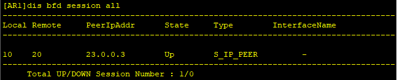
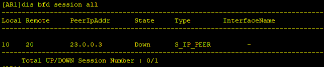

# 十七、BFD配置

## 重要配置命令

```bash
[Huawei] bfd # 开启 BFD 功能
[Huawei] bfd 1 bind peer-ip 23.0.0.3 source-ip 12.0.0.1 # BFD 1 绑定的对端 IP 为 23.0.0.3，源 IP 为 12.0.0.1
[Huawei-bfd-session-1] discriminator local 10 # 本地标识符 10
[Huawei-bfd-session-1] discriminator remote 20 # 远端标识符 20
[Huawei-bfd-session-1] commit # 提交配置
[Huawei] ip route-static 23.0.0.0 24 12.0.0.2 track bfd-session 1 # 到达 23.0.0.0/24 的静态路由绑定 BFD 1

[Huawei] bfd # 开启 BFD 功能
[Huawei] bfd 1 bind peer-ip 192.168.10.2 interface vlanif 10 # BFD 1 绑定的对端 IP 为 192.168.10.2 ，源接口为 vlanif10

[Huawei-bfd-session-1] discriminator local 10 # 本地标识符 10
[Huawei-bfd-session-1] discriminator remote 20 # 远端标识符 20
[Huawei-bfd-session-1] commit # 提交配置
[Huawei-Vlanif10] vrrp vrid 10 track bfd-session 1 increased 40 # vrid 10 绑定 bfd 1，会话状态 down，优先级增加 40

[Huawei-rip-1] bfd all-interfaces enable # RIP 的全部接口启用 BFD
[Huawei-ospf-1] bfd all-interfaces enable # OSPF 的全部接口启用 BFD
[Huawei-isis-1] bfd all-interfaces enable # ISIS 的全部接口启用 BFD
[Huawei-bgp] peer 2.2.2.2 bfd enable # 对 2.2.2.2 对等体启用 BF
```


## 拓扑


## 准备工作

| 准备工作 | 接口    | IP地址      |
| -------- | ------- | ----------- |
| AR1      | GE0/0/0 | 12.0.0.1/24 |
| AR2      | GE0/0/0 | 12.0.0.2/24 |
|          | GE0/0/1 | 23.0.0.2/24 |
| AR3      | GE0/0/0 | 23.0.0.3/24 |

## 步骤

1. 先配置静态路由

```bash
[AR1] ip route-static 23.0.0.0 24 12.0.0.2

[AR3] ip route-static 12.0.0.0 24 23.0.0.2
```

2. 配置BFD

```bash
[AR1] bfd
[AR1-bfd] quit
[AR1] bfd 1 bind peer-ip 23.0.0.3 source-ip 12.0.0.1
[AR1-bfd-session-1] discriminator local 10
[AR1-bfd-session-1] discriminator remote 20
[AR1-bfd-session-1] commit


[AR3] bfd
[AR3-bfd] quit
[AR3] bfd 1 bind peer-ip 12.0.0.1 source-ip 23.0.0.3
[AR3-bfd-session-1] discriminator local 20
[AR3-bfd-session-1] discriminator remote 10
[AR3-bfd-session-1] commit
```

此时查看bfd是否启动

```bash
[AR1] display bfd session all
```



这个时候，在AR2上shutdown接口G0/0/1



因此，BFD最大的作用，就是能够与其他协议进行联动，当出现down的时候，就能够有后续的操作进行应对。