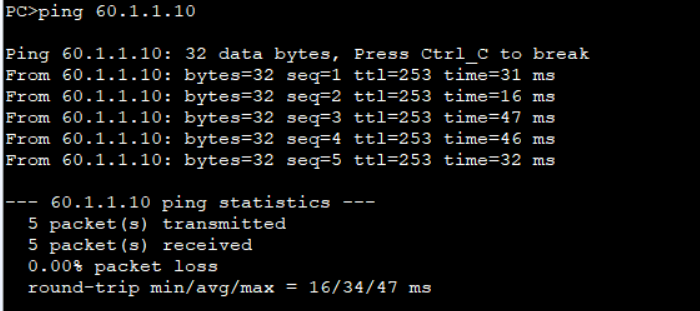
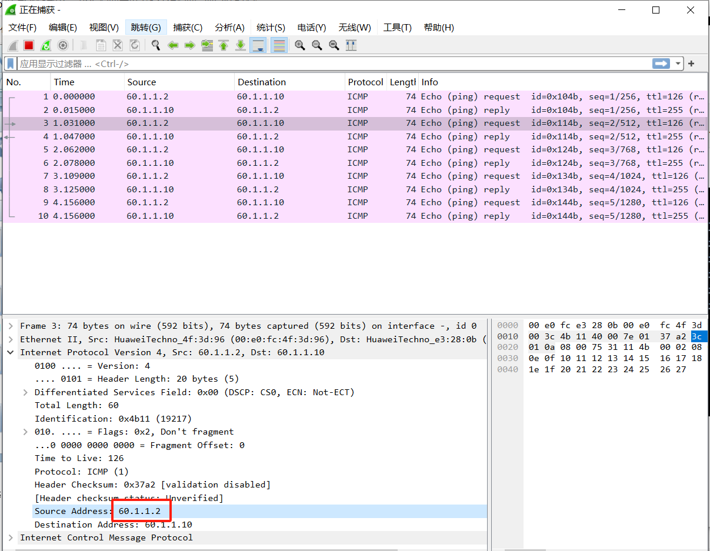
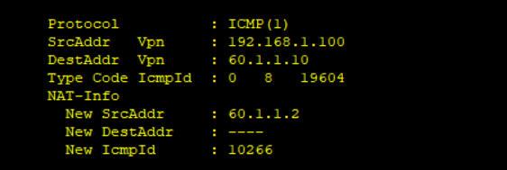

# 十三、NAT配置&端口映射配置

## 重要配置命令

```bash
[Huawei] nat address-group 1 60.1.1.2 60.1.1.5 # 配置可用公网地址池范围为 60.1.1.2 至 60.1.1.5
[Huawei] acl 2000 # 创建 acl 2000
[Huawei-acl-basic-2000] rule permit source 192.168.1.0 0.0.0.255 # 匹配源地址为 192.168.1.0/24 网段的 IP
[Huawei-GigabitEthernet0/0/1] nat outbound 2000 # 将 ACL 2000 匹配的内网地址转换为 g0/0/1 接口的 IP
[Huawei-GigabitEthernet0/0/1] nat static global 60.1.1.2 inside 192.168.1.100 # 将 192.168.1.100 转换为
60.1.1.2
[Huawei-GigabitEthernet0/0/1] nat outbound 2000 address-group 1 # 将 ACL 2000 匹配的内网地址转换为address-group 1 内的公网地址
[Huawei-GigabitEthernet0/0/1] nat server protocol tcp global 60.1.1.2 8080 inside 192.168.1.100 8080
# 将内网 IP 192.168.1.100 及其 TCP 8080 端口映射为公网 IP 60.1.1.2 的 8080 端口
[Huawei-GigabitEthernet0/0/1] nat server protocol tcp global current-interface 8080 inside 192.168.1.100 8080 # 将内网 IP 192.168.1.100 及其 TCP 8080 端口映射为该接口 IP 地址的 8080 端
```

## 拓扑


## 准备工作


## 步骤

1. 现在SW1上配置VLAN

```bash
[SW1] vlan batch 10 99
[SW1] interface GigabitEthernet 0/0/1
[SW1-GigabitEthernet0/0/1] port link-type access
[SW1-GigabitEthernet0/0/1] port default vlan 10

[SW1] interface GigabitEthernet 0/0/4
[SW1-GigabitEthernet0/0/4] port link-type access
[SW1-GigabitEthernet0/0/4] port default vlan 99

[SW1] interface Vlanif 10
[SW1-Vlanif10] ip address 192.168.1.1 24
[SW1] interface Vlanif 99
[SW1-Vlanif99] ip address 192.168.10.2 24

[SW1] ip route-static 0.0.0.0 0 192.168.10.1
```

2. 在AR1上配置路由和ACL

```bash
[AR1] interface GigabitEthernet 0/0/0
[AR1-GigabitEthernet0/0/0] ip address 192.168.10.1 24
[AR1-GigabitEthernet0/0/0] interface GigabitEthernet 0/0/1
[AR1-GigabitEthernet0/0/1] ip address 60.1.1.1 24

[AR1] ip route-static 192.168.1.0 24 192.168.10.2
[AR1] acl 2000
[AR1-acl-basic-2000] rule permit source 192.168.1.0 0.0.0.255
[AR1-acl-basic-2000] interface GigabitEthernet 0/0/1
[AR1-GigabitEthernet0/0/1] nat outbound 2000
```

此时用PC1去ping 60.1.1.10，是能够ping通的


### 静态映射

也很简单，直接在AR1上面进行静态映射即可

不过得记得把上一步的nat给undo掉才行

```bash
[AR1] interface GigabitEthernet 0/0/1
[AR1-GigabitEthernet0/0/1] nat static global 60.1.1.2 inside 192.168.1.100
```

测试能否ping通



使用抓包软件观察，发现源地址已经更改为`60.1.1.2`



### 地址池

同样的，得先把上个步骤的nat要undo掉才行

```bash
[AR1-GigabitEthernet0/0/1] nat outbound 2000 address-group 1
```

此时观察现象，用PC1去ping `60.1.1.10`

```bash
[AR1] display nat session all
```



源目的IP为192.168.1.100，目的地址是60.1.1.10，而后新的源地址为60.1.1.2