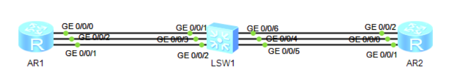
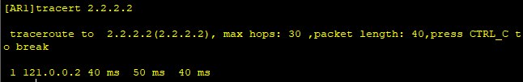

# 十九、交换机与路由器管理配置

## 重要配置命令

```bash
[Huawei] user-interface console 0 # 进入 Console 接口
[Huawei] user-interface vty 0 4 # 进入远程配置 vty 0 至 4 线程
[Huawei-ui-console0] idle-timeout 30 # 配置用户连接的超时时间为 30 分钟
[Huawei-ui-console0] user privilege level 15 # 配置 Console 用户界面的用户级别为 15
[Huawei-ui-console0] authentication-mode password # 配置用户认证方式为密码认证
[Huawei-ui-console0] set authentication password cipher huawei # 配置本地用户登录密码为 huawei
[Huawei-ui-console0] authentication-mode aaa # 配置用户认证方式为 AAA 认证
[Huawei] aaa # 进入 AAA 模式
[Huawei-aaa] local-user admin password cipher huawei # 配置本地用户登录用户名为 admin，密码为 huawei
[Huawei] ssh user 1 authentication-type password # 配置 SSH 用户的认证方式为 password

# 由于通过STelnet登录设备所使用的协议是SSH，因此必须设置VTY用户界面认证方式为AAA认证。

[Huawei] interface gigabitethernet 2/0/0 # 进入 g2/0/0 接口
[Huawei-GigabitEthernet2/0/0] standby interface GigabitEthernet 0/0/1 30 # g0/0/1 为备份接口，优先级为 30
[Huawei-GigabitEthernet2/0/0] standby interface GigabitEthernet 0/0/2 20 # g0/0/2 为备份接口，优先级为 20
[Huawei-GigabitEthernet2/0/0] standby timer delay 10 10 # 配置主备接口相互切换的延时均为 10 
```

## 拓扑



## 准备工作

| 准备工作 | 接口    | IP地址       |
| -------- | ------- | ------------ |
| AR1      | GE0/0/0 | 12.0.0.1/24  |
|          | GE0/0/1 | 121.0.0.1/24 |
|          | GE0/0/2 | 122.0.0.1/24 |
| AR2      | GE0/0/0 | 12.0.0.2/24  |
|          | GE0/0/1 | 121.0.0.2/24 |
|          | GE0/0/2 | 122.0.0.2/24 |

## 步骤

### 路由器管理

基本上，就是进入界面，然后配置管理员用户密码、权限等。

### 端口备份

1. 先在AR1上配置静态路由

```bash
[AR1]ip route-static 2.2.2.2 32 12.0.0.2
[AR1]ip route-static 2.2.2.2 32 121.0.0.2
[AR1]ip route-static 2.2.2.2 32 122.0.0.2
```

2. 设置GE0/0/1为主备份路由，GE0/0/2为副备份路由

```bash
[AR1] interface GigabitEthernet 0/0/0
[AR1-GigabitEthernet0/0/0] standby interface GigabitEthernet 0/0/1 30
[AR1-GigabitEthernet0/0/0] standby interface GigabitEthernet 0/0/2 20
```

此时`shutdown`AR1上的GE0/0/0，追踪路由`2.2.2.2`，可以发现IP地址沿着GE0/0/1通过了。



