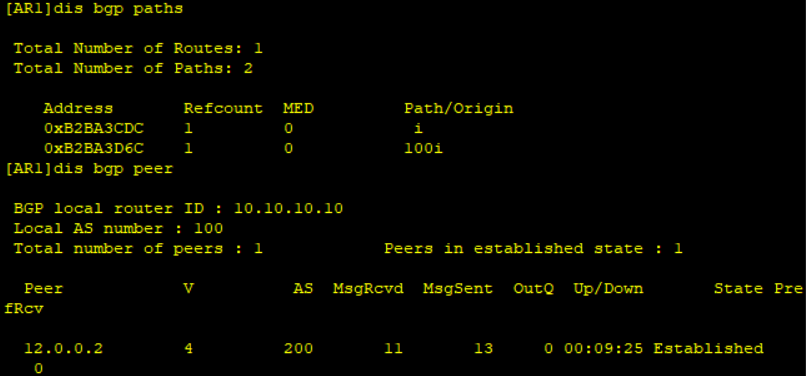
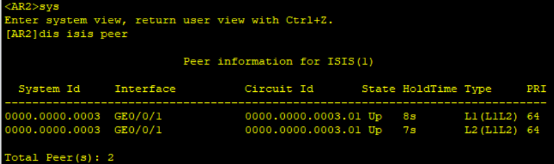
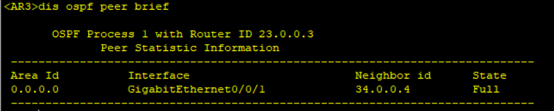
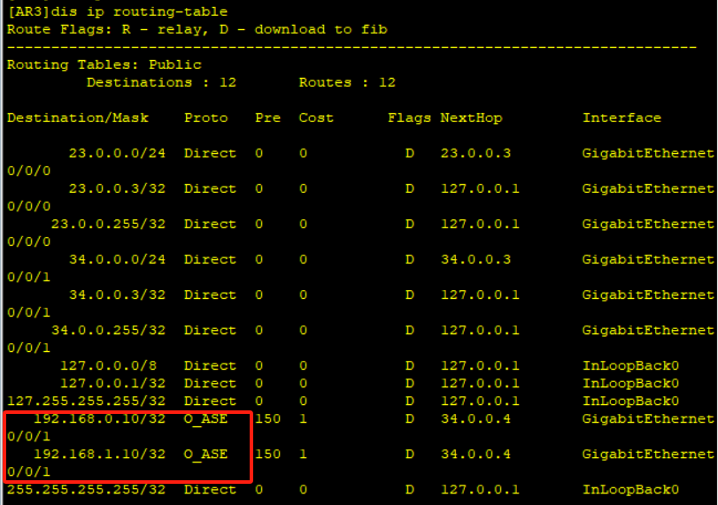

# 十二、路由引入

## 重要配置命令

```bash
[Huawei-ospf-1] import-route rip # ospf 中引入 rip 路由
```

## 拓扑


## 准备工作

| 设备名称 | 接口       | IP地址          |
| -------- | ---------- | --------------- |
| AR1      | LoopBack 0 | 10.10.10.10/32  |
|          | G0/0/0     | 12.0.0.1/24     |
| AR2      | G0/0/0     | 12.0.0.2/24     |
|          | G0/0/1     | 23.0.0.2/24     |
| AR3      | G0/0/0     | 23.0.0.3/24     |
|          | G0/0/1     | 34.0.0.3/24     |
| AR4      | G0/0/0     | 34.0.0.4/24     |
|          | LoopBack 0 | 192.168.0.10/32 |
|          | LoopBack 1 | 192.168.1.10/32 |

## 步骤

1. AR1和AR2之间建立EBGP

```bash
[AR1] bgp 100
[AR1-bgp] peer 12.0.0.2 as-number 200
[AR1-bgp] network 10.10.10.10 32

[AR2] bgp 200
[AR1-bgp] peer 12.0.0.1 as-number 100
```

使用`display bgp peer`检查是否建立成功



2. AR2和AR3之间建立ISIS

```bash
[AR2] isis
[AR2-isis-1] network-entity 49.0000.0000.0000.0002.00
[AR2-isis-1] interface GigabitEthernet 0/0/1
[AR2-GigabitEthernet0/0/1] isis enable

[AR3] isis
[AR3-isis-1] network-entity 49.0000.0000.0000.0003.00
[AR3-isis-1] interface GigabitEthernet 0/0/0
[AR3-GigabitEthernet0/0/1] isis enable
```

使用`display isis peer`检查是否配置成功



3. AR3和AR4之间建立OSPF

```bash
[AR3] ospf
[AR3-ospf-1] area 0
[AR3-ospf-1-area-0.0.0.0] quit
[AR3-ospf-1] quit
[AR3] interface GigabitEthernet 0/0/1
[AR3-GigabitEthernet0/0/1] ospf enable area 0

[AR4] ospf
[AR4-ospf-1] area 0
[AR4-ospf-1-area-0.0.0.0] quit
[AR4-ospf-1] quit
[AR4] interface GigabitEthernet 0/0/1
[AR4-GigabitEthernet0/0/1] ospf enable area 0
```

使用`display ospf peer brief`检查是否配置成功



4. AR4的虚拟口建立RIP

```bash
[AR4] rip
[AR4-rip-1] version 2
[AR4-rip-1] network 192.168.0.0
[AR4-rip-1] network 192.168.1.0
```

5. 把AR4的虚拟接口引入到AR3

```bash
[AR4] ospf
[AR4-ospf-1] import-route rip
```

此时，在AR3上就能看到AR4的虚拟路由接口的IP地址了

```bash
[AR3] display ip routing-table
```



