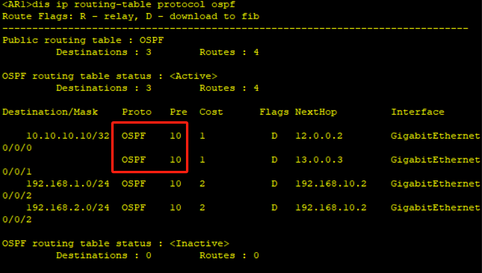

# 十五、PBR策略路由

## 重要配置命令

```bash
[Huawei] acl 2000 # 创建 acl 2000
[Huawei-acl-basic-2000] rule permit source 192.168.1.0 0.0.0.255 # 匹配源地址为 192.168.1.0/24 网段的 IP
[Huawei] traffic classifier a1 operator or # 创建流分类 a1，各规则之间是“逻辑或”
[Huawei-classifier-a1] if-match acl 2000 # 流分类匹配 acl 2000
[Huawei] traffic behavior b1 # 创建流行为 b1
[Huawei-behavior-b1] redirect ip-nexthop 23.0.0.3 # 流行为为重定向下一跳地址为 23.0.0.3
[Huawei] traffic policy p1 # 创建流策略列表 p1
[Huawei-trafficpolicy-p1] classifier a1 behavior b1 # 绑定流策略与 a1 行为 b1
[Huawei-GigabitEthernet0/0/0] traffic-policy p1 inbound # 在 g0/0/0 接口调用入方向流策略 p
```

## 准备工作


## 拓扑


## 步骤

1. 先配置好底层路由

配置LSW1

```bash 
[LSW1] vlan batch 10 20 99
[LSW1] interface GigabitEthernet 0/0/1
[LSW1-GigabitEthernet0/0/1] port link-type access
[LSW1-GigabitEthernet0/0/1] port default vlan 10
[LSW1-GigabitEthernet0/0/1] interface GigabitEthernet 0/0/2
[LSW1-GigabitEthernet0/0/2] port link-type access
[LSW1-GigabitEthernet0/0/2] port default vlan 20
[LSW1-GigabitEthernet0/0/2] interface GigabitEthernet 0/0/3
[LSW1-GigabitEthernet0/0/3] port link-type access
[LSW1-GigabitEthernet0/0/3] port default vlan 99
[LSW1-GigabitEthernet0/0/3] interface Vlanif 10
[LSW1-Vlanif10] ip address 192.168.1.1 24
[LSW1-Vlanif10] interface Vlanif 20
[LSW1-Vlanif20] ip address 192.168.2.1 24
[LSW1-Vlanif20] interface Vlanif 99
[LSW1-Vlanif99] ip address 192.168.10.2 24

# 开启OSPF
[LSW1] ospf
[LSW1-ospf-1] area 0
[LSW1-ospf-1-area-0.0.0.0] interface Vlanif 10
[LSW1-Vlanif10] ospf enable area 0
[LSW1-Vlanif10] interface Vlanif 20
[LSW1-Vlanif20] ospf enable area 0
[LSW1-Vlanif99] interface Vlanif 99
[LSW1-Vlanif99] ospf enable area 0
```

配置AR1、AR2、AR3

```bash
# AR1
[AR1] ospf 
[AR1-ospf-1] area 0
[AR1-ospf-1-area-0.0.0.0] interface GigabitEthernet 0/0/2
[AR1-GigabitEthernet0/0/2] ip address 192.168.10.1 24
[AR1-GigabitEthernet0/0/2] ospf enable area 0
[AR1-GigabitEthernet0/0/2] interface GigabitEthernet 0/0/0
[AR1-GigabitEthernet0/0/0] ip add 23.0.0.2 24
[AR1-GigabitEthernet0/0/0] ospf enable area 0
[AR1-GigabitEthernet0/0/0] interface GigabitEthernet 0/0/1
[AR1-GigabitEthernet0/0/1] ip add 24.0.0.2 24
[AR1-GigabitEthernet0/0/1] ospf enable area 0

# AR2
[AR2] ospf
[AR2-ospf-1] area 0
[AR2-ospf-1-area-0.0.0.0] interface GigabitEthernet 0/0/0
[AR2-GigabitEthernet0/0/0] ip address 23.0.0.3 24
[AR2-GigabitEthernet0/0/0] ospf enable area 0
[AR2-GigabitEthernet0/0/0] interface LoopBack 0
[AR2-LoopBack0] ip address 10.0.0.0 32
[AR2-LoopBack0] ospf enable area 0

# AR3
[AR3] ospf
[AR3-ospf-1] area 0
[AR3-ospf-1-area-0.0.0.0] interface GigabitEthernet 0/0/0
[AR3-GigabitEthernet0/0/0] ip address 24.0.0.4 24
[AR3-GigabitEthernet0/0/0] ospf enable area 0
[AR3-GigabitEthernet0/0/0] interface LoopBack 0
[AR3-LoopBack0] ip address 10.0.0.0 32
[AR3-LoopBack0] ospf enable area 0
```

3. 查看一下OSPF是否配置成功

```bash
[Huawei] display ospf peer brief
```


查看路由表



4. 配置策略路由

```bash
[AR1] acl 2000
[AR1-acl-basic-2000] rule permit source 192.168.1.0 0.0.0.255
[AR1-acl-basic-2000] acl 2001
[AR1-acl-basic-2001] rule permit source 192.168.2.0 0.0.0.255
[AR1-acl-basic-2001] quit
[AR1] tracert classifier a1 operator or
[AR1-classifier-a1] if-match acl 2000
[AR1-classifier-a1] traffic classifier a2 operator or
[AR1-classifier-a2] if-match acl 2001
[AR1-classifier-a2] quit
[AR1] traffic behavior b1
[AR1-behavior-b1] redirect ip-nexthop 23.0.0.3
[AR1-behavior-b1] traffic behavior b2
[AR1-behavior-b2] redirect ip-nexthop 24.0.0.4
[AR1-behavior-b2] quit

[AR1] traffic policy p1
[AR1-trafficpolicy-p1] classifier a1 behavior b1
[AR1-trafficpolicy-p1] classifier a2 behavior b2

[AR1] interface GigabitEthernet 0/0/2
[AR1-GigabitEthernet0/0/2] traffic-policy p1 inbound
```

开始抓包，查看PC1的IP是否去到AR2，PC2的IP是否去到AR3