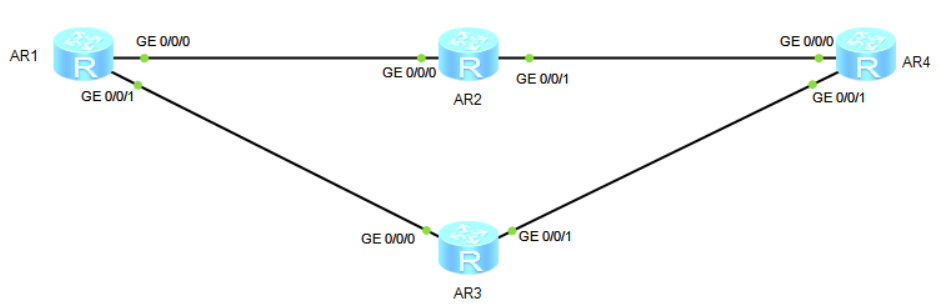
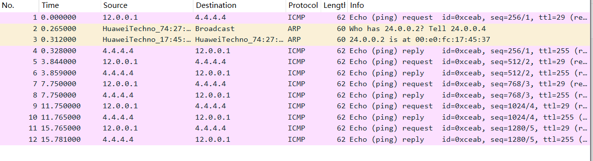
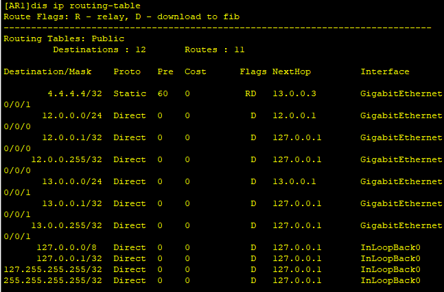

# 十八、NQA配置

## 重要配置命令

```bash
[Huawei] nqa test-instance linsir NB # 配置 nqa 测试例名为 linsir NB（一个名字而已，随便改）
[Huawei-nqa-admin-icmp] test-type icmp # 测试类型为 icmp
[Huawei-nqa-admin-icmp] destination-address ipv4 4.4.4.4 # 目的 IPv4 为 4.4.4.4
[Huawei-nqa-admin-icmp] source-address ipv4 12.0.0.1 # 源 IPv4 为 12.0.0.1
[Huawei-nqa-admin-icmp] frequency 1000 # 执行测试的时间间隔为 1000 毫秒
[Huawei-nqa-admin-icmp] probe-count 5 # 一次测试的探针数为 5
[Huawei-nqa-admin-icmp] start now # 立即开始
```

## 拓扑



## 准备工作

| 设备名称 | 接口       | IP地址      |
| -------- | ---------- | ----------- |
| AR1      | GE0/0/0    | 12.0.0.1/24 |
|          | GE0/0/1    | 13.0.0.1/24 |
| AR2      | GE0/0/0    | 12.0.0.2/24 |
|          | GE0/0/1    | 24.0.0.2/24 |
| AR3      | GE0/0/0    | 13.0.0.3/24 |
|          | GE0/0/1    | 34.0.0.3/24 |
| AR4      | GE0/0/0    | 24.0.0.4/24 |
|          | GE0/0/1    | 34.0.0.4/24 |
|          | LoopBack 0 | 4.4.4.4/32  |

## 步骤

1. 配置静态路由

```bash
[AR1] ip route-static 4.4.4.4 32 12.0.0.2 preference 10
[AR1] ip route-static 4.4.4.4 32 13.0.0.3

[AR2] ip route-static 4.4.4.4 32 24.0.0.4

[AR3]ip route-static 4.4.4.4 32 34.0.0.4

[AR4]ip route-static 12.0.0.0 24 24.0.0.2
[AR4]ip route-static 13.0.0.0 24 34.0.0.3
```

2. 配置nqa

```bash
[AR1] nqa test-instance AM test
[AR1-nqa-AM-test] test-type icmp
[AR1-nqa-AM-test] destination-address ipv4 4.4.4.4
[AR1-nqa-AM-test] source-port ipv4 12.0.0.1
[AR1-nqa-AM-test] frequency 1000
[AR1-nqa-AM-test] probe-count 5
[AR1-nqa-AM-test] start now
```

`start now`以后，在AR4的GE0/0/0上抓包，会发现有5个ICMP包



那如果此时，AR2上GE0/0/1`shutdown`了，就需要重新`start now`才能之后，IP才会自动更换了。

```bash
# 先联动
[AR1] ip route-static 4.4.4.4 32 12.0.0.2 preference 10 track nqa AM test

# 先undo start
[AR1-nqa-AM-test] undo start
[AR1-nqa-AM-test] start now
```

此时，查看AR1上的路由表，会发现IP路径已经从下面走过去了。



所以，NQA的作用，更像是临时性的检测工具。