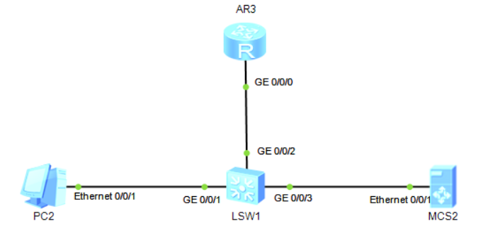

# 十六、端口镜像配置

## 重要配置命令

```bash
[Huawei] observe-port interface GigabitEthernet 2/0/0 # 配置观察端口
[Huawei-GigabitEthernet0/0/0] mirror to observe-port inbound # 将 g0/0/0 接口入方向流量镜像到观察端口
[Huawei] observe-port 1 interface GigabitEthernet 0/0/3 # 配置 g0/0/3 为本地观察端口，观察端口索引为 1
[Huawei-GigabitEthernet0/0/1] port-mirroring to observe-port 1 inbound # 将接口 g0/0/1 的入方向绑定到索引为 1 的观察端口上
```

## 准备工作

| 设备名称 | 接口    | IP地址        |
| -------- | ------- | ------------- |
| AR1      | G0/0/0  | 192.168.1.1   |
|          | G0/0/1  | 192.168.2.1   |
|          | G0/0/2  | 192.168.3.1   |
| AR2      | G0/0/0  | 192.168.1.100 |
| PC1      |         | 192.168.2.100 |
| MCS1     | E0/0/1  | 192.168.3.100 |
| PC2      |         | 192.168.1.100 |
| AR3      | GE0/0/0 | 192.168.1.200 |
| MCS2     |         | 192.168.1.150 |

## 拓扑

+ 根据路由的端口镜像配置


+ 根据交换机的端口镜像配置



## 步骤

### 路由端口镜像

1. 在AR2新建静态路由，与PC1通信

```bash
[AR2] ip route-static 192.168.1.0 24 192.168.2.1
```

2. 配置端口镜像

```bash
[AR1] observer-port interface GigabitEthernet 0/0/2
[AR1] interface GigabitEthernet 0/0/0
[AR1-GigabitEthernet0/0/0] mirror to observe-port inbound
```

在MCS1上的E0/0/1和AR2上的GE0/0/0上分别抓包，同时PC1ping`192.168.2.100`，可以发现，在MCS1上只抓了5个包，而在AR2上抓了10个包。

这是因为，AR2的应答包并没有给到MCS1。如果想要应答包也要给到MCS1，只需要更改一下命令即可

```bash
[AR1-GigabitEthernet0/0/0] mirror to observe-port both
```

参数`both`，进和出两个流量就都会给MCS1了。

### 交换机端口镜像

1. 在交换机上配置端口镜像

```bash
[LSW1] observe-port 1 interface GigabitEthernet 0/0/3
[LSW1]interface GigabitEthernet 0/0/1
[LSW1-GigabitEthernet0/0/1]port-mirroring to observe-port 1 inbound
```

可惜的是，在MCS2上抓包的时候，并不能抓到PC2的包，似乎是模拟器有问题。