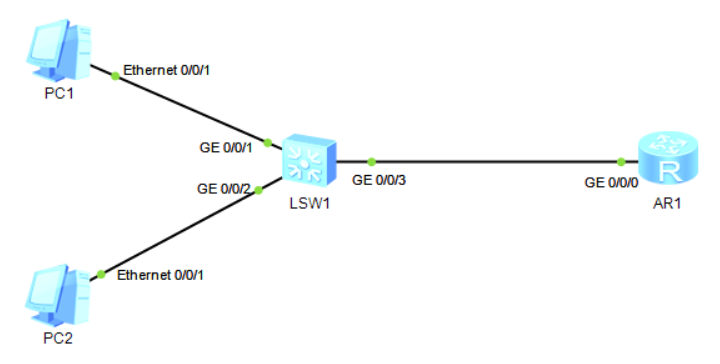
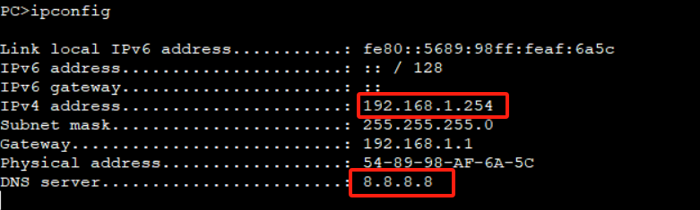
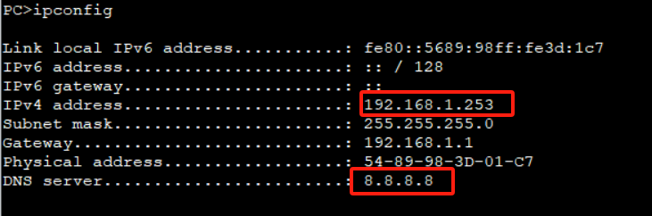
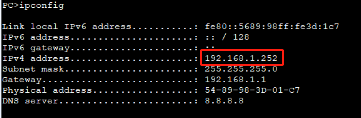
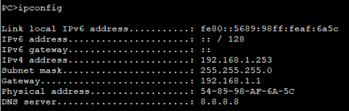

# 十四、DHCP服务配置

## 重要配置命令

```bash
[Huawei] dhcp enable # 开启 DHCP 服务
[Huawei] interface Vlanif 10 # 进入 vlanif 10 接口
[Huawei-Vlanif10] dhcp select interface # DHCP 选择接口模式
[Huawei-Vlanif10] dhcp server dns-list 8.8.8.8 # 配置 DNS 为 8.8.8.8
[Huawei-Vlanif10] dhcp server excluded-ip-address 192.168.1.100 # 排除 192.168.1.100 地址分配
[Huawei-Vlanif10] dhcp server excluded-ip-address 192.168.1.11 192.168.1.20 # 排除 192.168.1.11 至 192.168.1.20 的地址分配

[Huawei-Vlanif10] dhcp select global # DHCP 选择全局模式
[Huawei] ip pool vlan10 # 配置 DHCP 地址池 vlan10
[Huawei-ip-pool-vlan10] network 192.168.1.0 mask 255.255.255.0 # 配置地址池范围为 192.168.1.0/24 网段
[Huawei-ip-pool-vlan10] dns-list 8.8.8.8 # 配置 DNS 为 8.8.8.8
[Huawei-ip-pool-vlan10] gateway-list 192.168.1.1 # 配置网关为 192.168.1.1
[Huawei-ip-pool-vlan10] excluded-ip-address 192.168.1.100 # 配置排除 192.168.1.100 地址分配
[Huawei-ip-pool-vlan10] excluded-ip-address 192.168.1.11 192.168.1.20 # 排除 192.168.1.11 至 192.168.1.20 的地址分配

[Huawei] interface Vlanif 10 # 进入 vlanif 10 接口
[Huawei-Vlanif10] dhcp select relay # DHCP 选择中继模式
[Huawei-Vlanif10] dhcp relay server-ip 192.168.100.1 # DHCP 中继服务器地址为 192.168.100.
```

## 拓扑



## 准备工作


## 步骤

### 基于接口

直接在SW1上进行配置即可

```bash
[SW1] vlan 10
[SW1-vlan10] interface GigabitEthernet 0/0/1
[SW1-GigabitEthernet0/0/1] port link-type access
[SW1-GigabitEthernet0/0/1] port default vlan 10
[SW1-GigabitEthernet0/0/1] interface GigabitEthernet 0/0/2
[SW1-GigabitEthernet0/0/2] port link-type access
[SW1-GigabitEthernet0/0/2] port default vlan 10
[SW1-GigabitEthernet0/0/2] quit
[SW1] interface Vlanif 10
[SW1-Vlanif10] ip address 192.168.1.1 24
[SW1-Vlanif10] quit

[SW1] dhcp enable
[SW1] interface Vlanif 10
[SW1-Vlanif10] dhcp server dns-list 8.8.8.8
[SW1-Vlanif10] dhcp server excluded-ip-address 192.168.1.100
[SW1-Vlanif10] dhcp server excluded-ip-address 192.168.1.200
```

此时PC1和PC2上开启DHCP服务，可以看到PC1和PC2的IP地址都是自动获取





### 基于IP Pool

1. 得先把上一个步骤的dhcp清除掉

```bash
[SW1] interface Vlanif 10
[SW1-Vlanif10] undo hdcp select interface
```

2. 新建一个VLAN 99

```bash
[SW1] vlan 99
[SW1-vlan99] interface GigabitEthernet 0/0/3
[SW1-GigabitEthernet0/0/3] port link-type access
[SW1-GigabitEthernet0/0/3] port default vlan 99
[SW1-GigabitEthernet0/0/3] quit
[SW1] interface Vlanif 99
[SW1-Vlanif99] ip address 192.168.100.2 24
[SW1-Vlanif99] dhcp select relay
[SW1-Vlanif99] dhcp relay server-ip 192.168.100.1
```

3. 在AR2上开启DHCP服务

```bash
[AR1] interface GigabitEthernet 0/0/0
[AR1-GigabitEthernet0/0/0] ip address 192.168.100.1 24
[AR1-GigabitEthernet0/0/0] quit
[AR1] ip route-static 192.168.1.0 24 192.168.100.2

[AR1] dhcp enable
[AR1] ip pool 1
[AR1-ip-pool-1] network 192.168.1.0 mask 255.255.255.0
[AR1-ip-pool-1] dns-list 8.8.8.8
[AR1-ip-pool-1] gateway-list 192.168.1.1
[AR1-ip-pool-1] excluded-ip-address 192.168.1.254
[AR1-ip-pool-1] quit
[AR1] interface GigabitEthernet 0/0/0
[AR1-GigabitEthernet0/0/0] dhcp select global
```

重新在PC1和PC2上释放一下地址再开启DHCP即可看到PC1和PC2的IP地址



