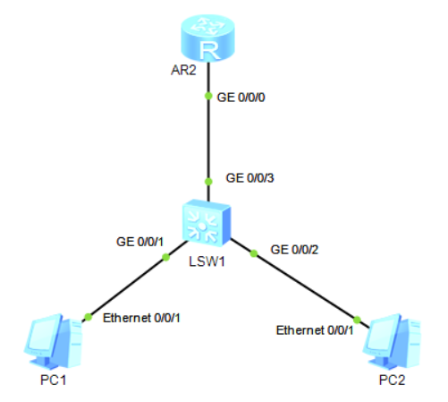
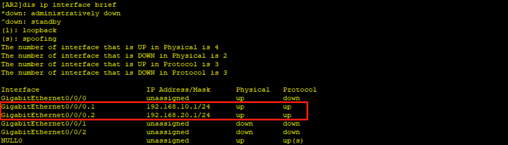
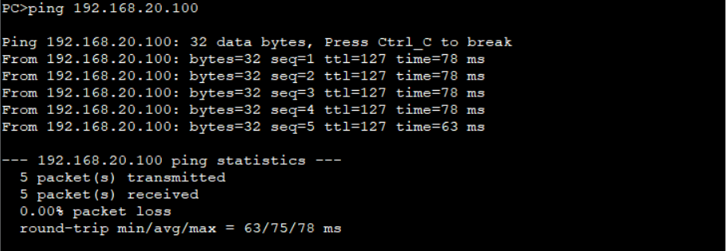
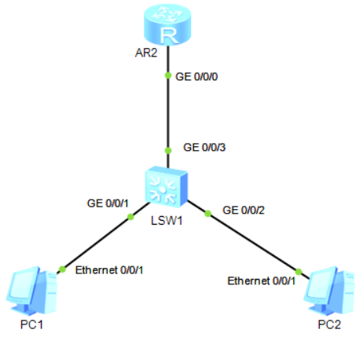
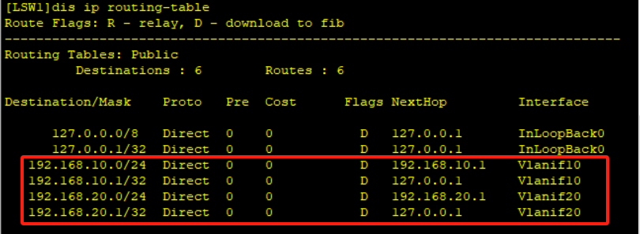
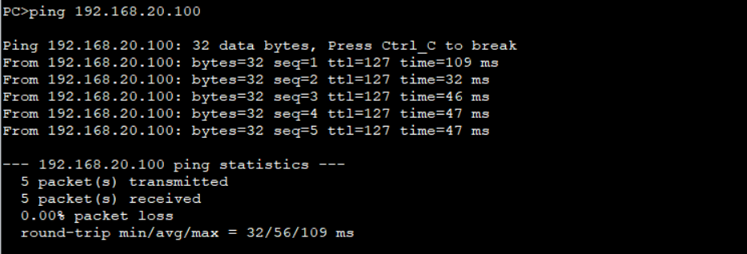

# 四、单臂路由与Vlan间路由配置

## 重要配置命令

```bash
# 单臂路由
[Huawei] interface GigabitEthernet 0/0/0.1 # 进入子接口 GigabitEthernet 0/0/0.1
[Huawei-GigabitEthernet0/0/0.1] ip address 192.168.1.1 24 # 配置子接口地址为 192.168.1.1，掩码长度 24 位
[Huawei] dot1q termination vid 10 # 子接口 Dot1q 可以终结 VLAN 10
[Huawei] arp broadcast enable # 开启 ARP 广播
# Vlan间路由配置
[Huawei] interface Vlanif 10 # 进入 vlanif 10
[Huawei-Vlanif10] ip address 192.168.1.1 24 # 配置 vlanif 10 地址为 192.168.1.1，掩码长度 24 位
```

## 单臂路由

### 拓扑



### 准备工作

| 设备名称 |     IP地址     |     网关     |
| :------: | :------------: | :----------: |
|   PC1    | 192.168.10.100 | 192.168.10.1 |
|   PC2    | 192.168.20.100 | 192.168.20.1 |

### 实验步骤

1. 先在`LSW1`上启动VLAN，给`PC1`划分`VLAN10`，`PC2`划分`VLAN20`，`G0/0/3`设置为`Trunk链路`

```bash
# PC1
[LSW1] interface GigabitEthernet 0/0/1
[LSW1-GigabitEthernet0/0/1] port link-type access
[LSW1-GigabitEthernet0/0/1] port default vlan 10
# PC2
[LSW1-GigabitEthernet0/0/1] interface GigabitEthernet 0/0/2
[LSW1-GigabitEthernet0/0/2] port link-type access
[LSW1-GigabitEthernet0/0/2] port default vlan 20
# GigabitEthernet 0/0/3
[LSW1-GigabitEthernet0/0/2] interface GigabitEthernet 0/0/3
[LSW1-GigabitEthernet0/0/3] port link-type trunk
[LSW1-GigabitEthernet0/0/3] port trunk allow-pass vlan all
```

2. 在路由器上配置单臂路由

```bash
# 在逻辑接口1上进行配置
[AR2] interface GigabitEther0/0/0.1
[AR2-GigabitEthernet0/0/0.1] ip address 192.168.10.1 24
[AR2-GigabitEthernet0/0/0.1] dot1q termination vid 10
[AR2-GigabitEthernet0/0/0.1] arp boradcast enable
# 在逻辑接口2上进行配置
[AR2-GigabitEthernet0/0/0.1] interface GigabitEther0/0/0.2
[AR2-GigabitEthernet0/0/0.2] ip address 192.168.10.1 24
[AR2-GigabitEthernet0/0/0.2] dot1q termination vid 10
[AR2-GigabitEthernet0/0/0.2] arp boradcast enable
```

可以使用`display ip interface brief`查看接口是否开启



3. 测试PC1能否ping通PC2



## Vlan间路由配置

其实近似理解为把交换机变成了带有网关的路由器，这样数据都不需要通过三层路由器就可以直接转发了。

### 拓扑



### 准备工作

| 设备名称 |     IP地址     |     网关     |
| :------: | :------------: | :----------: |
|   PC1    | 192.168.10.100 | 192.168.10.1 |
|   PC2    | 192.168.20.100 | 192.168.20.1 |

### 实验步骤

1. 在交换机`LSW1`上配置`VLAN10`、`VLAN20`

```bash
[LSW1] vlan batch 10 20
[LSW1] interface GigabitEthernet 0/0/1
[LSW1-GigabitEthernet0/0/1] port link-type access
[LSW1-GigabitEthernet0/0/1] port default vlan 10
[LSW1-GigabitEthernet0/0/1] interface GigabitEthernet 0/0/2
[LSW1-GigabitEthernet0/0/2] port link-type access
[LSW1-GigabitEthernet0/0/2] port default vlan 20
```

2. 配置`Vlanif`

```bash
[LSW1] interface Vlanif 10
[LSW1-Vlanif10] ip address 192.168.10.1 24
[LSW1-Vlanif10] quit
[LSW1] interface Vlanif 20
[LSW1-Vlanif20] ip address 192.168.20.1 24
```

可以使用`display ip routing-table`查看配置是否成功



用`PC1`去ping`PC2`

