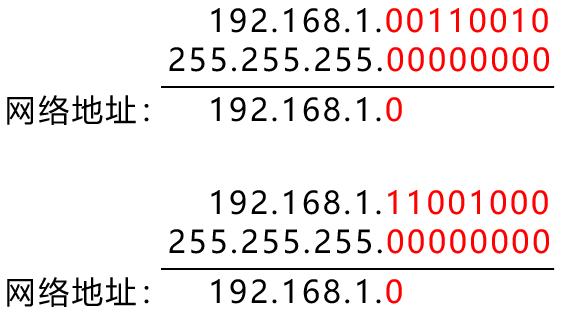
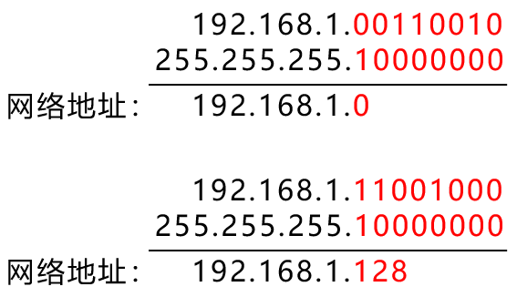

# IP地址与掩码计算

## 基础知识点

+ 与运算：全1为1，其余为0

+ 网络地址：每个网段的第一个IP地址

+ 掩码中，1表示网络位，0表示主机位。

## 例题

1. `192.168.1.100/24` 与 `192.168.1.200/24` 比较是否属于相同网段

   因为两个IP地址均为 `192.168.1.x`，所以只需要对比最后一位就行，即是：

   

   两者属于相同网段

2. `192.168.1.100/25` 与 `192.168.1.200/25` 比较是否属于相同网段

   熟练之后，可以直接对比

   

   对比发现，192.168.1.100/25 的网络地址为 `192.168.1.0`，而 192.168.1.200/25 的网络地址为 `192.168.1.128`，因此两者不属于相同网段