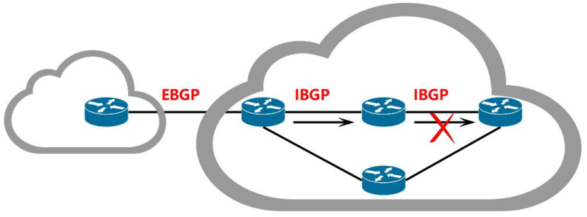
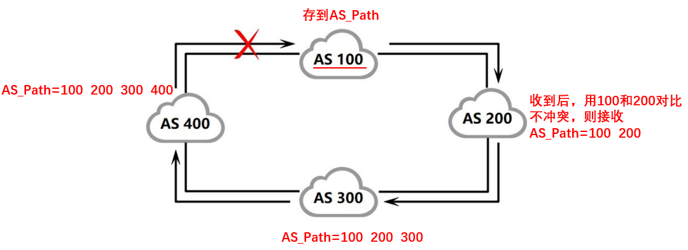

# BGP路由协议

基于==距离矢量路由协议==，适用于==自治域（AS）之间==路由

## 基本概念

1. EBGP对等体：AS边界路由相连
2. AS内部路由只有建立IBGP对等体才可以传递和接收BGP路由条目
3. 报文分装在传输层，端口179
4. 采用触发更新机制

## 报文类型

1. Open报文：建立BGP对等体连接
2. Update报文：通知网络是否更新或撤销
3. Notification报文：通知对等路由器检测到错误
4. Keepalive报文：维持BGP邻居，每60s周期发送。如果180s没有收到，则认为邻居断开
5. Rout-refresh报文：在改变路由策略后请求对等体重新发送路由信息

## 防环机制

### 1. 水平分割机制

IBGP收到的路由只能传一跳，一旦IBGP收到路由以后，就不会传到下一跳了

### 2. 通过AS_Path防环

### 防环机制导致无法传递路由问题

但是，防环机制也会带来一定的问题：无法传递路由。因此解决这个问题，就需要一些方法

1. AS内部使用IBGP全互联

2. AS内部使用RR路由反射器

3. AS内部使用联盟

## 路由属性

1. 公认必遵：Origin，AS_Path，Next_hop 

2. 公认任意：Local_Preference，Atomic_aggrega 

3. 可选过渡：Aggregator，Community 

4. 可选非过渡：MED，Cluster-List，Originator-ID

## 华为配置

具体可以点击这里看[实验操作](../../huawei/十一、BGP路由协议配置.md)