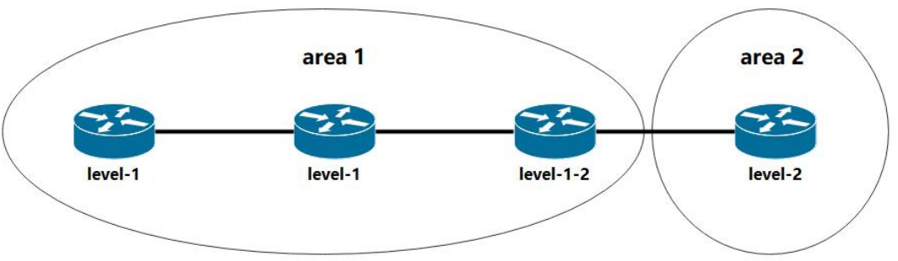

# IS-IS协议

基于==链路状态路由协议==，采用==Dijkstra算法==。

## 能干什么

主要用于在自治系统（AS）内部进行路由信息的交换和路由计算，中间系统到中间系统，一般用于运营商底层路由

## 基本概念

1. 路由优先级15
2. 使用NET地址作为协议地址
3. cost值越小，路径越优
4. 无论接口带宽多大，缺省时cost为10
5. 封装在二层

## 等级及区域划分

分为 level-1、level-2、level-1-2

1. level-1 只能与本区域的 level-1 和本区域 level-1-2 设备建立邻居关系
2. level-2 能与任意区域的 level-2和任意区域 level-1-2 设备建立邻居关系
3. level-2 为骨干区域，level-1 为非骨干区域

## 华为配置

具体可以点击这里看[实验操作](../../huawei/十、ISIS配置.md)