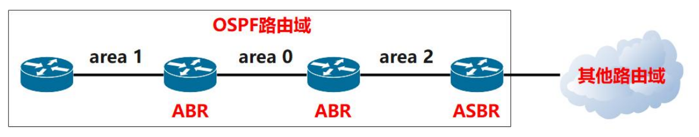
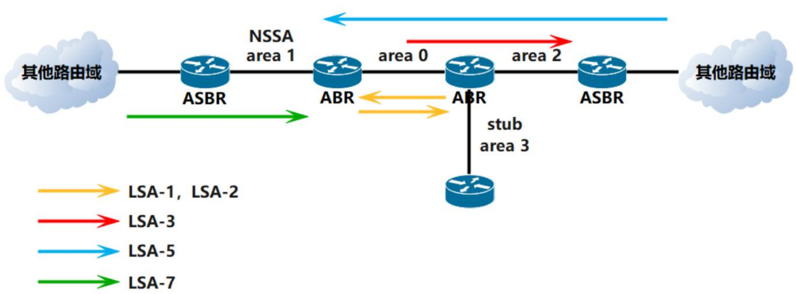

# OSPF协议

基于==链路状态路由协议==，采用==Dijkstra算法==。

## 基本概念

1. 封装在IP层，协议号89
2. 组播地址==224.0.0.5==和==224.0.0.6==
3. 触发更新机制
4. 影响邻居建立因素：router ID、area ID、hello时间、协议认证、子网掩码
5. 不同OSPF进程号，不影响建立邻居
6. cost越小，路径约优
7. 本身不存在环路

## 区域类型

+ 分单区域和多区域

+ area 0 (0.0.0.0) 为骨干区域，而且是必须存在的区域，无论是单区域还是多区域
+ 骨干区域不能分裂，必须要分裂的情况只能通过虚链路技术解决

## 设备类型

ABR：区域边界路由器，跨越OSPF不同区域的路由器

ASBR：自治域边界路由器，用来连接非OSPF路由区域的路由器

## 特殊区域

+ stub末节区域

+ totally stub完全末节区域

+ NSSA非纯末节区域

+ totally NSSA非纯完全末节区域

## 报文类型

1. Hello 报文：建立和维持邻居关系，周期型发送，4倍Hello时间没有收到Hello报文，就认为邻居断开
2. DD 报文：描述LSDB摘要信息
3. LSR 报文：向对方请求LSA
4. LSU 报文：向对方发送LSA
5. LSAck 报文：对收到LSA确认

## 选举

简单来说就是选老大、老二，然后其他人就只和老大、老二联系就行了

### router ID选举

1. 手动配置路由器全局 router ID
2. OSPF 进程下手动配置 router ID
3. 选择LoopBack接口IP地址最大的作为router ID
4. 选择活跃的物理接口IP地址最大的作为router ID

### DR、BDR选举

1. 优先级越大的越优先成为DR，其次为BDR
2. 选举router ID最大的作为DR，其次为BDR

## LSA类型

1. 1-LSA：描述每台路由器所在区域的链路状态信息，会在本区域泛洪
2. 2-LSA：描述区域间Drother列表
3. 3-LSA：描述区域间路由信息
4. 4-LSA：描述ASBR信息，研究怎么到ASBR
5. 5-LSA：描述OSPF外部路由信息
6. 7-LSA：5-LSA有的都有，且7-LSA只在NSSA中才会出现

## 华为配置

具体可以点击这里看[实验操作](../../huawei/九、OSPF路由协议配置.md)