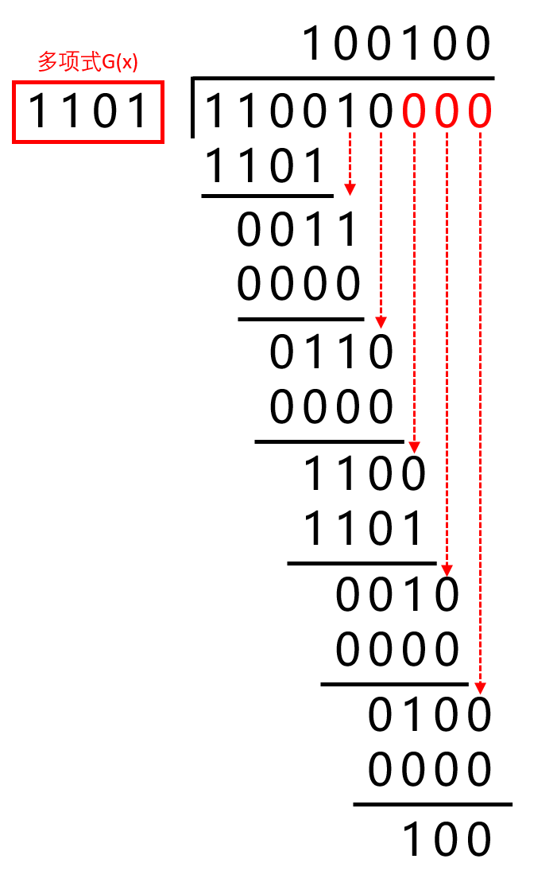

# CRC 循环冗余校验

## 能干什么

可以检错多位数据，但是不能纠错

## 例题

假设发送信息码 `110010`，生成多项式 $g(x)=x^3+x^2+1$ ，根据多项式最高次幂数，在信息码后面补充对应个数的0，信息码补后为 `110010000` 。多项式的对应位（x^0^ ,  x^1^ ,  x^2^ 以此类推）存在即表示为1，不存在即表示为0，得出CRC校验码为 `1101`，将信息码与校验码进行异或运算：

因此，最终结果为 `110010 100`

