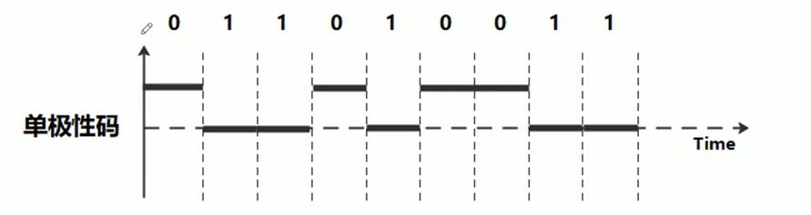
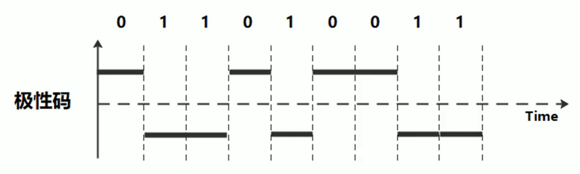
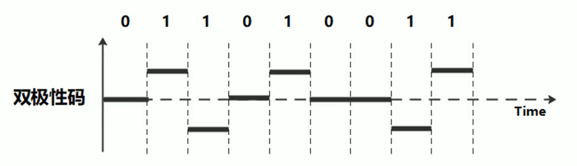
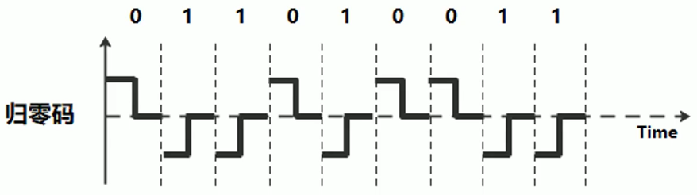
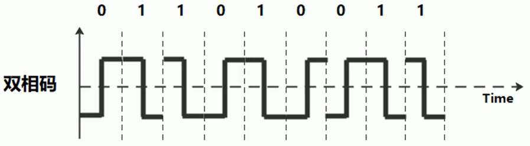
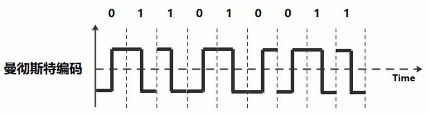
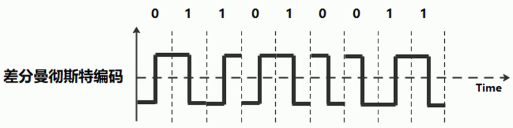
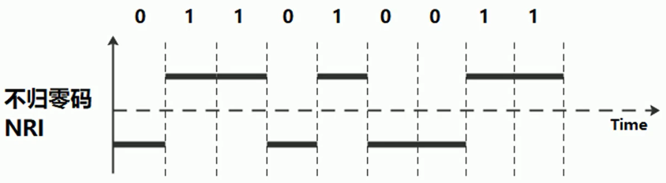
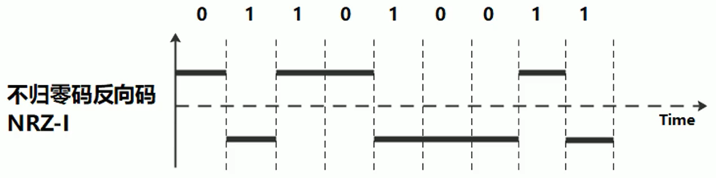
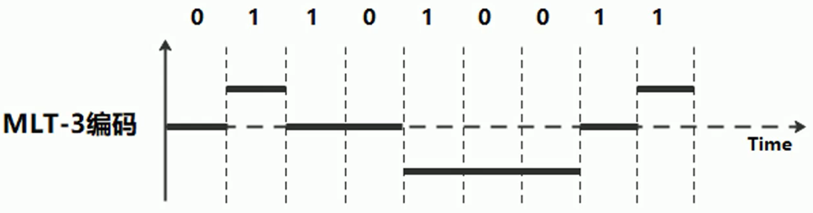

# 基本编码

## 1. 单极性码

**0表示正极，1表示零电平**

## 2. 极性码

**0表示正极，1表示负极**

## 3. 双极性码

**0表示零电平；1表示电平在正、负极间交替翻转**

## 4. 归零码

**0表示正极到零电平，1表示负极到零电平**

## 5. 双相码

**0表示负极到正极，1表示正极到负极**

## 6. 曼彻斯特编码

**0表示负极到正极，1表示正极到负极**

**编码效率：50%**

::: tip 注意

有的时候，0也可以表示正极到负极，1表示负极到正极也没有问题的

:::

## 7. 差分曼彻斯特编码

**1表示电平翻转，0表示电平不翻转**

**编码效率：50%**

## 8. 不归零码NRZ

**0表示负极，1表示正极**

**编码效率：100%**

## 9. 不归零码反向码NRZ-I

**1表示电平反转，0表示电平不翻转**

**编码效率：100%**

## 10. MLT-3编码

**1表示电平按正负极与零电平顺序交替跳变，0表示不跳变**

## 11. mB/nB编码

**4B/5B：编码效率80%**

**8B/10B：编码效率80%**

**64B/66B：编码效率97%**

**8B/6T编码：编码效率75%**