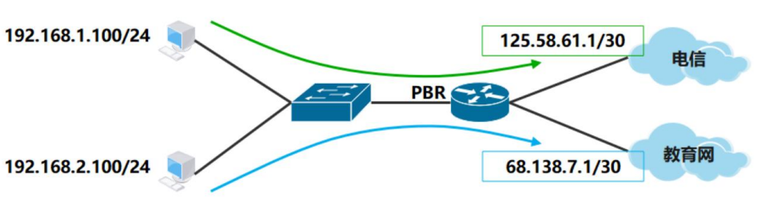

# PBR 策略路由

## 能干什么

比传统路由转发原理更加灵活

可以把PBR想象成网络世界里的“交通警察”。在网络中，数据包就像是一辆辆汽车，它们需要按照某种规则或路线来行驶，才能到达它们的目的地。而PBR就是这个“交通警察”，它负责根据管理员设定的策略，来指挥数据包应该如何行驶。

## 基本概念

可以基于源地址、数据应用、数据包长度等转发数据包

还可以实现负载均衡

## 华为配置

具体可以点击这里看[实验操作](../../huawei/十五、PBR策略路由.md)